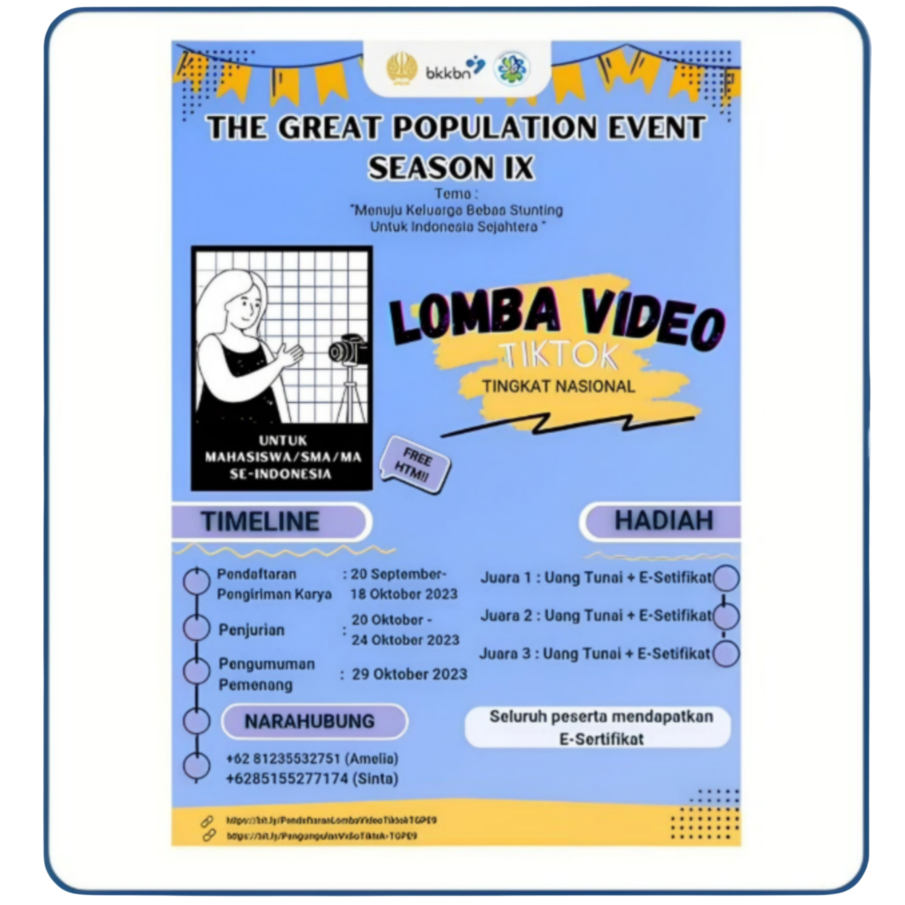
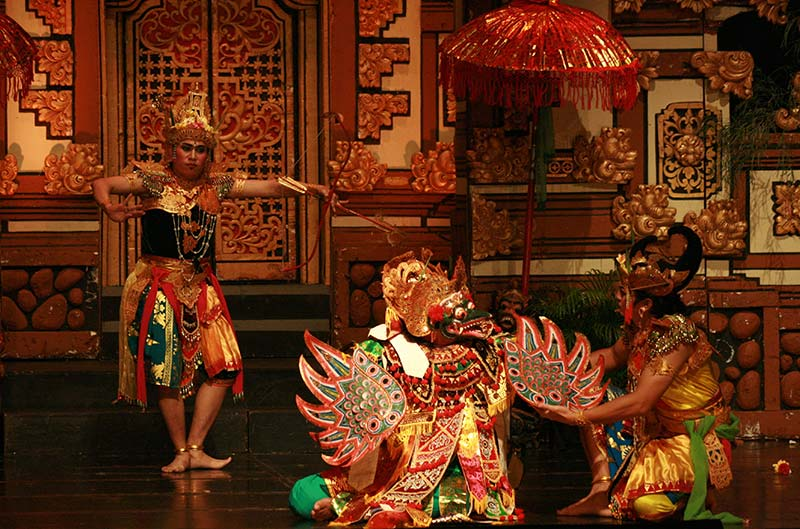

# Website-UKM
Spesifikasi Kebutuhan Perangkat Lunak

Untuk

Website UKM

Versi 1.0 disetujui

Disusun Oleh: 
  1. Feis Aulia Fatchuriani (22091397053)
  2. Berlin Marsyah Yustina (22091397062)
  3. Tsamarah Mu’adzah Lubis (22091397074)

D4 Manajemen Informatika

Fakultas Vokasi

Universitas Negeri Surabaya

Tahun 2023

1. Pendahuluan 
1.1 Tujuan Penulisan Dokumen

Dokumen SKPL ini bertujuan untuk menciptakan panduan bagi tim pengembangan dalam membangun website yang efisien dan sesuai dengan kebutuhan UKM. Dokumen ini juga akan membantu dalam memastikan bahwa website UKM dapat menyediakan informasi yang lengkap dan terbaru tentang kegiatan, jadwal, dan berita terkini terkait UKM, meningkatkan efektivitas dalam mempromosikan kegiatan serta prestasi UKM kepada anggota mahasiswa, calon anggota, dan masyarakat umum, menyediakan informasi yang lengkap dan terbaru tentang kegiatan, jadwal, dan berita terkini terkait UKM. Selain itu, dokumen ini akan memainkan peran penting dalam mengelola pengembangan agar website berfungsi dengan baik sesuai harapan pengguna. Dengan demikian, tujuan utama dokumen ini adalah memastikan bahwa website UKM bisa menjadi alat yang efektif dalam mencapai tujuan dan visi UKM di lingkungan perguruan tinggi. 

1.2 Konvensi Dokumen
 Konvensi dokumen yang digunakan untuk pengembangan website ini adalah sebagai berikut:
<li>Website adalah halaman informasi yang disediakan melalui jalur internet sehingga bisa diakses di seluruh dunia selama terhubung dengan internet. </li>  
<li>HTML adalah singkatan dari Hyper Text Markup Language yang merupakan sintaks bahasa yang digunakan dalam pengembangan website. 
<li>CSS adalah singkatan dari Cascading Style Sheet yang merupakan salah satu bahasa pemrograman website untuk mengendalikan beberapa komponen dalam sebuah website sehingga akan lebih terstruktur dan seragam.  </li>
<li>JavaScript adalah bahasa pemrograman tingkat tinggi dan dinamis. JavaScript populer di internet dan dapat bekerja di sebagian besar penjelajah web. Kode JavaScript dapat disisipkan dalam halaman web menggunakan tag script.</li> 

1.3 Audiens yang Dituju dan Pembaca yang Disarankan
<li>Audiens: Audiens yang dituju dari website ini adalah para anggota, calon anggota, mahasiswa umum, pengurus, dan dosen dari Universitas Negeri Surabaya yang tertarik untuk mendapatkan informasi lebih detail tentang Unit Kegiatan Mahasiswa (UKM) dan ingin mengenal lebih dalam tentang kegiatan mahasiswa yang ada di Universitas Negeri Surabaya. </li>
<li>Saran: Dokumen SKPL Website Unit Kegiatan Mahasiswa (UKM) ini digunakan untuk mendapatkan informasi yang lebih detail tentang Unit Kegiatan Mahasiswa (UKM) yang ada di Universitas Negeri Surabaya. Oleh karena itu, kami menyarankan kepada pembaca untuk membaca dokumen SKPL ini dengan seksama terlebih dahulu.</li>  
1.4 Lingkup Produk

Lingkup produk untuk website Unit Kegiatan Mahasiswa (UKM) mencakup sejumlah komponen kunci yang dirancang untuk memenuhi kebutuhan dan tujuan UKM tersebut. Halaman utama (homepage) akan memberikan gambaran singkat tentang UKM, dengan informasi mengenai kegiatan dan acara yang akan datang serta tautan penting ke bagian-bagian lainnya. Profil UKM akan memuat informasi rinci mengenai sejarah, visi, misi, dan nilai-nilai UKM, sambil menampilkan struktur organisasi dan daftar pengurus yang bertanggung jawab. Bagian anggota akan memuat daftar anggota UKM, sementara agenda kegiatan akan mencakup daftar acara, pertemuan, dan kegiatan yang diadakan oleh UKM. Ada juga bagian berita dan pengumuman untuk memastikan pengguna tetap terinformasi, serta galeri foto dan video yang berisi dokumentasi visual dari berbagai kegiatan UKM. Selain itu, adanya forum diskusi atau ruang interaksi dapat memungkinkan anggota dan pengguna untuk berkomunikasi, berbagi ide, dan berdiskusi tentang topik-topik tertentu. Semua komponen ini dirancang untuk menciptakan pengalaman yang informatif dan terlibat bagi anggota UKM dan pengguna lainnya dalam mendukung keberhasilan UKM. 

1.5 Referensi  
Dokumen-dokumen yang digunakan sebagai referensi dalam pembuatan SKPL ini adalah sebagai berikut:
<li>Sadewa, I., & Siahaan, K. (2016). Analisis dan Perancangan Sistem Informasi UKM. Jurnal Manajemen Sistem Informasi. </li>
<li>Deni Kusuma Fajri, Agi Putra Kharisma, Ratih Kartika Dewi. (2017). "Perancangan Website Unit Kegiatan Mahasiswa dengan Metodologi Users Centered Design." Jurnal Pengembangan Teknologi Informasi dan Ilmu Komputer, Vol. 1, No. 12, Desember 2017. </li>
<li>Bagja Sumarlin, Dede Rohmat Apandi, Opan Dilaga. (2019). "Rancangan Web Sistem Informasi UKM (SIUK) 'GL01'. </li>
<li>Firdhaus Hari Saputro Al Haris, Sri Huning Anwariningsih, Aziz Jihadian Barid. (2018, Januari 11). "Pemodelan Aplikasi Unit Kegiatan Mahasiswa (UKM) Universitas Sahid Surakarta." Jurnal Gaung Informatika, Vol. 8, No. 2, Juli 2015. </li>
<li>Agung Rifqi Hidayat, Tri Listyorini, Tutik Khotimah. "Aplikasi Manajemen Unit Kegiatan Mahasiswa pada Universitas Muria Kudus Berbasis Web." </li>  
 2. Deskripsi Keseluruhan
 2.1 Perspektif Produk 
	
Website Unit Kegiatan Mahasiswa (UKM) adalah sebuah website online yang dirancang khusus untuk memfasilitasi interaksi dan keterlibatan anggota dan non anggota Unit Kegiatan Mahasiswa (UKM) serta memberikan informasi yang komprehensif tentang semua UKM yang ada di Universitas Negeri Surabaya. Dengan desain dan isi yang menarik dan informatif, website ini digunakan untuk meningkatkan pengalaman anggota UKM, calon anggota, dan pengguna umum yang ingin mengenal lebih dalam kegiatan mahasiswa di universitas. 

	
2.2 Fungsi Produk 

Website Unit Kegiatan Mahasiswa (UKM) memiliki beragam fungsi penting yang mendukung tujuan dan kegiatan UKM tersebut. Berikut adalah beberapa fungsi utama dari website UKM:
Website UKM adalah sarana untuk memperluas jangkauan di kalangan mahasiswa dan masyarakat umum. Ini dapat membantu dalam menarik minat anggota baru dan berpotensi mengundang partisipasi lebih banyak dalam kegiatan UKM.
Website menyediakan platform untuk memberikan informasi lengkap tentang UKM, termasuk tujuan, visi, misi, sejarah, dan struktur organisasi. Calon anggota atau pihak yang tertarik dapat dengan mudah memahami apa yang UKM tawarkan.
Website dapat memiliki formulir pendaftaran anggota online yang memudahkan calon anggota untuk mendaftar ke dalam UKM. Ini juga dapat mengurangi kerumitan administratif.
UKM dapat menggunakan website untuk mengumumkan dan mempromosikan kegiatan-kegiatan yang akan datang. Informasi tentang tanggal, tempat, dan deskripsi acara dapat diakses oleh anggota UKM dan orang-orang yang tertarik.
Website memungkinkan UKM untuk membagikan berita dan pemberitahuan terkini kepada anggota dan pengunjung. Ini termasuk prestasi UKM, perubahan dalam jadwal, atau pemberitahuan penting lainnya.

2.3 Kelas dan Karakteristik Pengguna
  Website UKM ini berkaitan dengan beberapa entitas luar, yaitu mahasiswa, senat dan admin UKM. Hal-hal yang dilakukan oleh entitas-entitas tersebut yaitu :
  Mahasiswa
<li>Dapat melakukan pendaftaran ke UKM </li>
<li>Dapat mencari informasi mengenai UKM </li>
<li>Dapat mengetahui kegiatan UKM </li>
<li>Dapat melihat data anggota UKM </li>
 Senat
<li>Melihat kegiatan UKM </li>
<li>Memverifikasi kegiatan UKM </li>
<li>Memverifikasi kehadiran kegiatan UKM </li>
<li>Dapat melihat data anggota UKM </li>
 Admin UKM
<li>Membuat kegiatan UKM </li>
<li>Menerima pendaftaran UKM </li>
<li>Dapat melihat dan mengubah data anggota UKM </li>
 2.4 Lingkungan Operasi 
<li>Server Side </li>
Perangkat yang digunakan adalah Windows sebagai Operating System (Sistem Operasi)
<li>Client Side</li>
Perangkat lainnya adalah:
IOS, Android, dan Windows sebagai sistem operasi menjalankan dan mengunjungi sistem
<li>Development Tools </li>
Perangkat yang digunakan untuk pengembangan sistem dan penyimpanan database adalah:
PhpMyAdmin sebagai sistem penyimpanan database Pengguna dan admin.
HTML, CSS, dan JavaScript sebagai Bahasa pemrograman.
Browser dan Develpment sebagai pengujian dan debug.  
 2.5 Kendala Desain dan Implementasi 

Desain dan implementasi website UKM dapat menghadapi sejumlah kendala yang perlu diperhatikan. Berikut adalah beberapa kendala umum yang mungkin timbul selama proses ini dan cara mengatasinya:
<li>Beberapa website UKM sering kali menghadapi masalah dengan kurangnya konten yang diperbarui secara teratur. Untuk mengatasi ini, buat rencana konten yang jelas dan libatkan anggota UKM dalam penghasilan konten baru. </li>
<li>Keamanan website adalah hal yang penting. Pastikan untuk menginstal pembaruan keamanan secara berkala dan menggunakan alat keamanan yang sesuai untuk melindungi website dari serangan dan ancaman siber.</li>
<li>Sekalipun website telah dibangun, jika tidak dipromosikan dengan baik, mungkin akan kurang dikenal oleh mahasiswa dan masyarakat. Pastikan untuk memasukkan tautan ke website UKM dalam berbagai materi promosi UKM. </li>
<li>Website yang diisi dengan konten yang tidak berkualitas dapat mengurangi reputasi UKM. Pastikan bahwa semua konten yang diunggah ke website memiliki kualitas yang baik dan relevan.
UKM mungkin kesulitan mendapatkan dukungan keuangan untuk pemeliharaan website. Cari cara untuk memasukkan pemeliharaan website dalam anggaran UKM atau cari sponsor atau donatur yang dapat membantu dalam pembiayaan ini. </li> 

2.6 Dokumentasi Pengguna

Dokumentasi bagi pengguna Website UKM antara lain sebagai berikut:
 1. Deskripsi Umum Sistem:
<li>Tujuan: Website UKM ini bertujuan untuk memfasilitasi mahasiswa dalam pengembangan diri melalui kegiatan-kegiatan yang sesuai dengan minat, bakat, dan kreativitas mereka. Website ini juga bertujuan untuk memberikan informasi, komunikasi, dan koordinasi antara pengurus, anggota, dan calon anggota unit kegiatan mahasiswa </li>
<li>Manfaat: Manfaat website UKM ini membantu mahasiswa mengasah kemampuan dan ketrampilan dalam bidang tertentu, mengembangkan keterampilan berorganisasi, komunikasi dan sosial, serta memperluas jaringan dan silaturahmi, sekaligus meningkatkan prestasi dan kontribusi terhadap sekolah dan masyarakat. </li>
2. Fitur: 
<li>Profil ukm yang berisi tentang visi, misi, sejarah, struktur organisasi, prestasi, dan kontak ukm. </li>
<li>Galeri ukm yang berisi tentang foto-foto, video-video, atau karya-karya yang dihasilkan oleh ukm. </li>
<li>Berita ukm yang berisi tentang informasi terbaru, agenda, pengumuman, atau laporan kegiatan yang dilakukan anggota ukm.</li>
<li>Forum ukm yang berisi tentang ruang diskusi, tanya jawab, atau sharing antara pengurus, anggota, dan calon anggota ukm tersebut.</li>
<li>Pendaftaran ukm yang berisi tentang formulir online untuk mendaftar sebagai anggota atau calon anggota ukm. </li>
 2.7 Asumsi dan Ketergantungan

Dalam pengembangan website Unit Kegiatan Mahasiswa (UKM), terdapat beberapa asumsi dan dependensi yang perlu dipertimbangkan. Asumsi dan dependensi ini adalah faktor-faktor yang dapat memengaruhi perencanaan, pengembangan, dan pengelolaan website tersebut. 

Asumsi:

1. Ketersediaan Anggaran: Asumsi bahwa ada anggaran yang cukup untuk mendukung pengembangan dan pemeliharaan website UKM.

2. Akses Internet: Asumsi bahwa anggota UKM dan pengguna umum memiliki akses internet yang memadai untuk mengakses website.

3. Penggunaan Perangkat Modern: Asumsi bahwa pengguna website UKM menggunakan perangkat modern yang mendukung teknologi web terbaru, seperti browser yang kompatibel.

4. Konten Tersedia: Asumsi bahwa konten seperti informasi tentang UKM, jadwal kegiatan, dan berita akan disediakan oleh pengurus UKM atau pihak terkait.

5. Kerjasama Tim: Asumsi bahwa ada kerjasama yang baik antara pengembang web dan pengurus UKM dalam mengelola dan memperbarui konten website.

Dependensi:

1. Basis Data UKM: Website UKM mungkin bergantung pada basis data yang mengandung informasi tentang anggota, kegiatan, dan berbagai data terkait UKM. Ketergantungan ini memerlukan pemeliharaan dan pengelolaan basis data.

2. Hosting Web: Website UKM memerlukan hosting web yang dapat diandalkan dan skalabel. Ketergantungan ini terkait dengan pemilihan penyedia hosting dan perawatan server.

3. Keamanan Informasi: Website UKM dapat menjadi target serangan siber, oleh karena itu, diperlukan dependensi pada langkah-langkah keamanan seperti firewall, enkripsi, dan pemantauan keamanan.

4. Ketersediaan Konten: Untuk menjaga website tetap informatif, dependensi pada pihak yang bertanggung jawab untuk menyediakan konten yang relevan dan terbaru, termasuk pengurus UKM yang harus memberikan informasi terkini.

5. Kompatibilitas Browser: Website UKM harus dapat diakses dengan baik di berbagai browser web yang berbeda. Ini bergantung pada kemampuan pengembang untuk menguji dan memastikan kompatibilitas.

6. Kepatuhan Hukum: Website UKM perlu mematuhi semua peraturan dan hukum yang berlaku, seperti privasi data dan hak cipta. Dependensi pada pemahaman dan kepatuhan terhadap regulasi ini sangat penting.

7. Sumber Daya Manusia: Terkadang, pengembangan dan pemeliharaan website memerlukan sumber daya manusia yang terampil. Dependensi pada keberadaan atau ketersediaan pengembang web yang kompeten dapat memengaruhi proyek.

8. Pengalaman Pengguna: Website UKM harus dirancang dengan mempertimbangkan pengalaman pengguna. Dependensi pada umpan balik dari pengguna dan penyesuaian berdasarkan respons tersebut. 

  3. Kebutuhan Antarmuka Eksternal  
3.1 Antarmuka Pengguna
<li>Aplikasi menggunakan antarmuka berbasis web. </li>
<li>Pengguna berinteraksi dengan sistem menggunakan keyboard dan mouse. </li>  
3.2 Antarmuka Perangkat Keras

Antarmuka perangkat keras dari website UKM mengacu pada bagian dari sistem yang berinteraksi langsung dengan perangkat keras fisik yang mendukung operasi dan kinerja website. Berikut adalah beberapa komponen antarmuka perangkat keras yang perlu diperhatikan dalam pengembangan dan pengelolaan website UKM:
1. Server
Server adalah perangkat keras utama yang menyimpan dan mengelola data, konten, dan aplikasi yang diperlukan untuk website UKM. Server ini dapat berupa server fisik (hardware server) atau server virtual (virtual server) yang di-hosting di cloud.
2. Basis Data
Basis data (database server) adalah komponen perangkat keras yang digunakan untuk menyimpan, mengelola, dan mengambil data yang diperlukan oleh website, seperti informasi anggota, konten, dan catatan kegiatan.
3. Infrastruktur Jaringan
Infrastruktur jaringan melibatkan perangkat keras seperti router, switch, dan firewall yang memungkinkan website untuk berkomunikasi dengan pengguna dan perangkat lain di internet dengan aman.
4. Penyimpanan
Kapasitas penyimpanan adalah komponen perangkat keras yang penting untuk menyimpan konten website, gambar, video, dan berkas lainnya. Ini dapat mencakup hard drive fisik di server atau penyimpanan awan (cloud storage).
6. Memori
Memori (RAM) adalah komponen perangkat keras yang digunakan untuk menyimpan data sementara yang diperlukan oleh server saat menjalankan aplikasi web. Memori yang cukup besar dapat meningkatkan kinerja website. 

3.3 Antarmuka Perangkat Lunak
  <li>Aplikasi diakses menggunakan web browser. </li>
  <li>Dikembangkan menggunakan bahasa pemrograman html, css, java script. </li>
  <li>Database yang digunakan adalah msql. </li>
  3.4 Antarmuka Komunikasi

 Website UKM ini merupakan suatu sistem yang dihubungkan ke jaringan komputer melalui komputer desktop, sehingga pihak yang bertugas (admin, manager) dapat memantau sistem melalui jaringan komputer. Dengan demikian, aliran informasi menjadi lebih lancar. 

4. Fitur Sistem dan Kerangka Desain Fitur

  5. Persyaratan Nonfungsional Lainnya
 5.1 Persyaratan Kinerja
Persyaratan kinerja adalah aspek kritis dalam merancang dan mengembangkan website UKM. Berikut adalah beberapa persyaratan kinerja yang perlu dipertimbangkan untuk website UKM:
<li>Waktu Muat Halaman </li>
Website memuat halaman utama dalam waktu yang cepat, biasanya dalam beberapa detik.
<li>Kapasitas Pengguna </li>
Website harus mampu menangani jumlah pengguna yang berinteraksi dengan website secara bersamaan tanpa mengalami penurunan kinerja yang signifikan.
<li>Kecepatan Respons Server </li>
Server yang menjalankan website harus memberikan respons dalam waktu yang cepat terhadap permintaan pengguna.
<li>Skalabilitas </li>
Website harus dapat berkembang dengan baik seiring pertumbuhan dan peningkatan pengguna.
<li>Kompatibilitas Perangkat dan Browser </li>
Website harus kompatibel dengan berbagai perangkat (desktop, mobile, tablet) dan berbagai browser web. 
  5.2 Persyaratan Keselamatan 

Website UKM ini sangat aman untuk digunakan oleh pengguna dan hanya berhubungan langsung dengan admin. Maka, ketika terjadi permasalahan yang mengakibatkan kebobolan data pengguna ketika menggunakan website, pengguna dapat langsung melaporkan kejadian tersebut ke pihak berwenang. 

5.3 Persyaratan Keamanan 
 Persyaratan keamanan website Unit Kegiatan Mahasiswa (UKM) sangat penting untuk melindungi data dan pengguna, mencegah ancaman siber, serta menjaga integritas dan ketersediaan website. Berikut adalah beberapa persyaratan keamanan yang perlu dipertimbangkan dalam pengembangan dan pengelolaan website UKM:
<li>Proteksi Data Pengguna </li>
Website harus memiliki mekanisme enkripsi data (HTTPS) untuk melindungi data pribadi dan sensitif pengguna, seperti informasi pendaftaran anggota.
<li>Manajemen Akses yang Tepat </li>
Hanya pengguna yang sah dan berwenang yang harus memiliki akses ke bagian-bagian tertentu dari website, seperti data anggota atau informasi penting lainnya.
<li>Pemantauan Keamanan </li>
Website harus memantau keamanan yang memungkinkan deteksi cepat terhadap aktivitas mencurigakan atau ancaman siber.
<li>Pengelolaan Kata Sandi yang Kuat </li>
Pengguna harus diharuskan menggunakan kata sandi yang kuat, dan website harus memiliki kebijakan perubahan kata sandi secara berkala.
<li>Pencatatan Keamanan </li>
Website harus mencatat aktivitas keamanan, termasuk upaya masuk yang gagal, untuk menganalisis dan melacak insiden potensial.

  5.4 Atribut Kualitas Perangkat Lunak
Berikut adalah contoh atribut kualitas perangkat lunak dalam konteks sebuah website UKM:
<li>Ketersediaan </li>
Website harus tersedia 24/7 sehingga anggota UKM dapat mengakses informasi dan layanan kapan saja.
<li>Kinerja </li>
Website memiliki waktu muat halaman yang cepat sehingga pengguna tidak mengalami penundaan saat mengakses informasi atau mendaftar kegiatan UKM.
<li>Usability </li>
Antarmuka pengguna website dirancang dengan baik, dengan menu navigasi yang jelas dan instruksi yang mudah dipahami untuk memudahkan anggota mendaftar atau menemukan informasi.
<li>Portabilitas </li>
Website berfungsi dengan baik di berbagai browser web.
<li>Integrasi </li>
Website terhubung dengan sistem basis data UKM untuk mengelola informasi anggota, sehingga data dapat diakses dan diperbarui dengan mudah.
<li>Keamanan Data </li>
Data anggota dan catatan kegiatan UKM disimpan dengan enkripsi yang kuat dan hanya dapat diakses oleh pihak yang berwenang.

  5.5 Atribut Bisnis

Atribut bisnis dalam website UKM adalah kunci yang mendukung pertumbuhan dan keberhasilan unit kegiatan mahasiswa tersebut. Salah satu atribut bisnis yang penting adalah kemampuan website untuk menarik anggota baru dan mendorong partisipasi aktif dalam kegiatan UKM. Dengan antarmuka yang menarik dan informasi yang mudah diakses, website dapat menjadi alat yang efektif dalam menarik minat mahasiswa untuk bergabung dan berkontribusi dalam UKM. Selain itu, kemampuan website dalam mempromosikan acara, kegiatan, atau produk UKM secara efektif juga merupakan atribut bisnis yang penting. Melalui pemasaran yang baik, website dapat meningkatkan visibilitas UKM dan menarik minat dari calon anggota atau sponsor potensial, yang dapat membantu dalam mendukung kegiatan UKM. Interaksi yang baik dengan pengguna, baik anggota UKM maupun pemangku kepentingan lainnya, juga menjadi faktor penting dalam membangun komunitas yang kuat dan berkelanjutan. Dengan demikian, atribut bisnis ini berkontribusi secara signifikan dalam mencapai tujuan dan kesuksesan UKM melalui website. 

6. Persyaratan Lainnya
<li>Admin: Pemilik yang merupakan seseorang yang bertanggungjawab untuk perawatan sistem dan serta bertanggungjawab terhadap operasional sistem.</li>
<li>User: Karyawan yang merupakan seseorang yang bertanggungjawab terhadap pelayanan pemesanan.</li>
<li>Website: Halaman informasi yang disediakan melalui jalur internet sehingga bisa diakses di seluruh dunia selama terhubung dengan internet. </li>
<li>HTML: Singkatan dari Hyper Text Markup Language yang merupakan sintaks bahasa yang digunakan dalam pengembangan website. </li>
<li>CSS: Singkatan dari Cascading Style Sheet yang merupakan salah satu bahasa pemrograman website untuk mengendalikan beberapa komponen dalam sebuah website sehingga akan lebih terstruktur dan seragam. </li>
<li>PHP: Singkatan dari Hypertext Prepocessor yang merupakan bahasa pemrograman yang digunakan secara luas untuk penanganan pembuatan dan pengembangan sebuah website dan bisa digunakan bersamaan dengan HTML.Javascript: Bahasa pemrograman tingkat tinggi dan dinamis. Javascript populer di internet dan dapat bekerja di sebagian besar penjelajah web. Kode javascript dapat disisipkan dalam halaman web menggunakan tag script. </li>
<li>Maintanance: Kegiatan untuk memelihara atau menjaga suatu sistem dan mengadakan perbaikan atau penggantian yang diperlukan agar terdapat suatu keadaan operasi yang memuaskan sesuai dengan apa yang direncanakan. </li>

  Lampiran A: Glosarium

Lampiran B: Analisa Model
  Flowchart

  Entity Relationship Diagram 

  Use Case

  Class Diagram

Lampiran C: Daftar yang akan ditentukan

Daftar yang ditentukan dalam website UKM dapat bervariasi tergantung pada jenis UKM, tujuan website, dan kebutuhan anggota serta pengguna lainnya. Namun, berikut adalah beberapa jenis daftar yang umumnya ditemukan dalam website UKM:
Daftar Anggota
Daftar anggota UKM beserta profil masing-masing, termasuk nama, jurusan, tahun masuk, dan kontak informasi. Ini memungkinkan anggota untuk mengenal satu sama lain dan mempermudah komunikasi dalam UKM.
Agenda Kegiatan
Daftar acara, pertemuan, dan kegiatan yang diadakan oleh UKM, beserta tanggal, waktu, dan lokasi. Ini membantu anggota dan pengguna lain untuk mengetahui jadwal kegiatan UKM.
Berita dan Pengumuman
Daftar berita, pengumuman, atau artikel terkait UKM, seperti kegiatan UKM, prestasi anggota, atau informasi terbaru. Ini memungkinkan anggota dan pengguna untuk tetap terinformasi.
Galeri Foto dan Video
Daftar foto dan video terkait kegiatan dan acara UKM. Ini memungkinkan pengguna untuk melihat dokumentasi visual dari kegiatan UKM.
Pendaftaran Kegiatan 

Daftar kegiatan atau acara yang memerlukan pendaftaran, beserta formulir pendaftaran dan informasi terkait proses pendaftaran.
Kontak dan Informasi Hubungi
Daftar informasi kontak UKM, termasuk alamat email, nomor telepon, alamat fisik, atau formulir kontak online untuk pertanyaan atau permintaan informasi.

LAPORAN ‘WEBSITE UKM’

Dosen Pengampu:
I Gde Agung Sri Sidhimantra, S.Kom., M.Kom. 
Ari Kurniawan, S.Kom., M.T.

Disusun Oleh:
Feis Aulia Fatchuriani   	   (22091397053)
Berlin Marsyah Yustina             (22091397062)
Tsamarah Mu’adzah Lubis        (22091397074)

PROGRAM STUDI D4 MANAJEMEN INFORMATIKA
FAKULTAS VOKASI
UNIVERSITAS NEGERI SURABAYA
2023
Header 

`<!--header-->` adalah komentar HTML yang digunakan untuk memberikan informasi atau penjelasan tentang bagian kode tertentu. Dalam kasus ini, komentar ini menandakan bahwa kita akan mendefinisikan bagian header dari halaman web.
`<header class="header">`adalah elemen HTML `<header>` yang digunakan untuk menandai bagian header dari halaman. Atribut `class` digunakan untuk memberikan elemen ini kelas CSS dengan nama "header". Kelas CSS ini dapat digunakan untuk mengubah tampilan atau gaya header dengan CSS.
`<a href="#" class="logo"><i class="fas fa-spinner"></i> UKM UNESA </a>` adalah elemen anchor (`<a>`) yang digunakan untuk membuat tautan (link) dalam header. Tautan ini memiliki beberapa elemen:
`href="#"` adalah atribut `href` yang menunjukkan URL yang akan diakses saat tautan diklik. Dalam hal ini, tanda pagar (`#`) digunakan, yang biasanya digunakan untuk mengarahkan tautan ke bagian yang sama di halaman yang sedang dilihat (tindakan JavaScript mungkin digunakan untuk menangani perubahan URL).
`class="logo"` adalah atribut `class` yang memberikan tautan ini kelas CSS dengan nama "logo".
`<i class="fas fa-spinner"></i>` adalah elemen ikon yang dibungkus dalam elemen `<i>`. Ikon ini mungkin merupakan ikon FontAwesome yang digunakan untuk menampilkan ikon "spinner" (ikon yang berputar) sebelum teks "UKM UNESA".
`UKM UNESA’ adalah teks yang akan ditampilkan dalam tautan.
`<nav class="navbar">` adalah elemen navigasi (`<nav>`) yang digunakan untuk menandai bagian navigasi header. Atribut `class` digunakan untuk memberikan elemen ini kelas CSS dengan nama "navbar".
Di dalam elemen `<nav>`, terdapat beberapa tautan navigasi yang masing-masing memiliki elemen `<a>`. Setiap tautan memiliki atribut `href` yang menunjukkan URL yang akan diakses saat tautan diklik, dan teks tautan yang akan ditampilkan kepada pengguna.
`<a href="index.html">Beranda</a>`
`<a href="profile.html">Profil</a>`
`<a href="berita_terkini.html">Berita Terkini</a>`
`<a href="Event.html">Event</a>`
`<a href="kontak.html">Kontak</a>`
Kode ini secara keseluruhan menciptakan bagian header dari halaman web, termasuk logo, tautan navigasi, dan pengaturan tampilan dengan menggunakan kelas CSS yang diberikan. Logo menggunakan ikon "spinner" dari FontAwesome dan menyediakan tautan ke berbagai halaman seperti Beranda, Profil, Berita Terkini, Event, dan Kontak.

`
` adalah elemen div yang diberi kelas CSS "icons". Elemen ini digunakan untuk mengelompokkan ikon-ikon atau tombol-tombol ke dalam satu div sehingga mereka dapat diatur atau diubah tampilannya bersamaan.
`

` adalah elemen div yang digunakan untuk menampilkan ikon tiga garis horisontal yang umumnya digunakan sebagai ikon menu (tombol menu). Mari jabarkan atribut dan kelas yang digunakan dalam elemen ini:
`class="fas fa-bars"` adalah atribut `class` yang menggunakan kelas CSS "fas" (merupakan kelas FontAwesome) dan "fa-bars" yang mengacu pada ikon tiga garis horisontal.
`id="menu-btn"` adalah atribut `id` yang memberikan elemen ini sebuah ID khusus dengan nama "menu-btn". ID ini dapat digunakan untuk merujuk elemen ini dalam kode JavaScript atau CSS.
`

` adalah elemen div yang digunakan untuk menampilkan ikon kaca pembesar, yang biasanya digunakan sebagai tombol pencarian. Elemen ini memiliki atribut dan kelas yang serupa dengan elemen sebelumnya:
`class="fas fa-search"` adalah atribut `class` yang menggunakan kelas CSS "fas" (merupakan kelas FontAwesome) dan "fa-search" yang mengacu pada ikon kaca pembesar.
`id="search-btn"` adalah atribut `id` yang memberikan elemen ini sebuah ID khusus dengan nama "search-btn".
`

` adalah elemen div yang digunakan untuk menampilkan ikon pengguna atau akun. Elemen ini juga memiliki atribut dan kelas yang serupa dengan elemen sebelumnya:
`class="fas fa-user"` adalah atribut `class` yang menggunakan kelas CSS "fas" (merupakan kelas FontAwesome) dan "fa-user" yang mengacu pada ikon pengguna atau akun.
`id="login-btn"` adalah atribut `id` yang memberikan elemen ini sebuah ID khusus dengan nama "login-btn".

Form Pencarian (`<form class="search-form">`)
`<form action="" class="search-form">` adalah elemen form dengan atribut `class` "search-form". Form ini digunakan untuk melakukan pencarian.
`<input type="search" id="search-box" placeholder="Search here...">` adalah input yang digunakan untuk memasukkan kata kunci pencarian. Atribut `type="search"` menunjukkan bahwa ini adalah input pencarian. Atribut `id="search-box"` memberikan input ini sebuah ID khusus dengan nama "search-box", yang dapat digunakan dalam JavaScript atau CSS. Atribut `placeholder` adalah teks placeholder yang muncul dalam input sebelum pengguna memasukkan teks.
`<label for="search-box" class="fas fa-search"></label>` adalah elemen label yang digunakan untuk memberikan label untuk input pencarian. Atribut `for` menghubungkan label dengan input berdasarkan ID. Dalam hal ini, label ini memiliki kelas CSS "fas" dan "fa-search," yang mengacu pada ikon kaca pembesar. Ini adalah label visual yang menampilkan ikon pencarian.
Form Login (`<form class="login-form">`)
`<form action="" class="login-form">` adalah elemen form dengan atribut `class` "login-form". Form ini digunakan untuk memungkinkan pengguna masuk ke akun mereka.
`<h3>Login Now</h3>` adalah elemen judul yang menampilkan teks "Login Now."
`<input type="email" placeholder="Your Email" class="box">` adalah input yang digunakan untuk memasukkan alamat email pengguna. Atribut `type="email"` menunjukkan bahwa ini adalah input email, dan atribut `placeholder` adalah teks placeholder yang muncul dalam input.
`<input type="password" placeholder="Your Password" class="box">` adalah input yang digunakan untuk memasukkan kata sandi pengguna. Atribut `type="password"` menunjukkan bahwa ini adalah input kata sandi, dan atribut `placeholder` adalah teks placeholder.
`
Forget your password <a href="#">Click Here</a>
` adalah paragraf teks yang berisi tautan "Click Here" yang mungkin digunakan untuk mengatur ulang kata sandi jika lupa.
`
Don't Have Any Account? <a href="#">Create Now</a>
`  adalah paragraf teks yang berisi tautan "Create Now" yang mungkin digunakan untuk mendaftar atau membuat akun baru.
`<input type="submit" value="Login Now" class="btn">`  adalah tombol submit yang digunakan untuk mengirimkan formulir login. Nilai "Login Now" akan ditampilkan pada tombol, dan atribut `class` "btn" dapat digunakan untuk memberikan gaya khusus dengan CSS.

Footer

`<section class="footer">` adalah elemen HTML `<section>` yang digunakan untuk menandai bagian footer dari halaman web. Atribut `class` digunakan untuk memberikan elemen ini kelas CSS dengan nama "footer".
`
` adalah div yang digunakan untuk mengelompokkan berbagai elemen dalam footer. Atribut `class` "box-container" digunakan untuk memberikan elemen ini kelas CSS dengan nama "box-container".
`
` adalah div yang digunakan untuk mengelompokkan konten tertentu dalam footer. Atribut `class` "box" digunakan untuk memberikan elemen ini kelas CSS dengan nama "box".
`<h3>UKM UNESA <i class="fas fa-spinner"></i></h3>` adalah elemen judul tingkat 3 (`<h3>`) yang menampilkan teks "UKM UNESA" diikuti oleh ikon "spinner" yang mungkin merupakan ikon dari FontAwesome. Ikon ini disisipkan dalam elemen `<i>`. Ini adalah judul yang mungkin mengidentifikasi lembaga atau organisasi yang memiliki halaman web tersebut.
`
Lorem ipsum dolor, sit amet consectetur adipisicing elit. Maiores, laudantium?
` adalah elemen paragraf (`
`) yang berisi teks "Lorem ipsum dolor, sit amet consectetur adipisicing elit. Maiores, laudantium?". Teks ini mungkin berisi deskripsi atau informasi tambahan tentang lembaga atau organisasi tersebut.
`
` adalah div yang digunakan untuk mengelompokkan tautan sosial media yang mungkin memungkinkan pengguna untuk berbagi konten dari halaman web tersebut. Atribut `class` "share" digunakan untuk memberikan elemen ini kelas CSS dengan nama "share".
`` adalah tautan sosial media yang mengacu ke Facebook. Atribut `href="#"` menunjukkan bahwa tautan ini tidak memiliki URL yang ditentukan. Kelas CSS "fab fa-facebook-f" mungkin digunakan untuk menampilkan ikon Facebook.
`` adalah tautan sosial media yang mengacu ke Twitter. Atribut `href="#"` menunjukkan bahwa tautan ini tidak memiliki URL yang ditentukan. Kelas CSS "fab fa-twitter" mungkin digunakan untuk menampilkan ikon Twitter.
`` adalah tautan sosial media yang mengacu ke Instagram. Atribut `href="#"` menunjukkan bahwa tautan ini tidak memiliki URL yang ditentukan. Kelas CSS "fab fa-instagram" mungkin digunakan untuk menampilkan ikon Instagram.

Container Utama (`
`)
Ini adalah div yang digunakan untuk mengelompokkan dua kotak (box) yang berisi informasi kontak dan tautan cepat.
Atribut `class="box-container"` digunakan untuk memberikan elemen ini kelas CSS dengan nama "box-container".
Kotak Kontak (`
`)
Ini adalah div yang berisi informasi kontak.
Terdapat elemen-elemen berikut dalam kotak kontak:
`<h3>Contact Us</h3>` adalah judul tingkat 3 yang menampilkan teks "Contact Us".
`<a href="#" class="links"><i class="fas fa-phone"></i>+123-456-789</a>` adalah tautan yang mungkin digunakan untuk menghubungi nomor telepon pertama. Ikon telepon ditampilkan menggunakan elemen `<i>` dengan kelas "fas fa-phone".
`<a href="#" class="links"><i class="fas fa-phone"></i>+111-222-333</a>` adalah tautan yang mungkin digunakan untuk menghubungi nomor telepon kedua.
`<a href="#" class="links"><i class="fas fa-envelope"></i>ukmunesa@unesa.ac.id</a>` adalah tautan yang mungkin digunakan untuk mengirim email ke alamat email yang tercantum. Ikon email ditampilkan menggunakan elemen `<i>` dengan kelas "fas fa-envelope".
`<a href="#" class="links"><i class="fas fa-map-marker-alt"></i>Surabaya, Jawa Timur</a>` adalah tautan yang mungkin mengacu pada lokasi fisik atau alamat. Ikon lokasi ditampilkan menggunakan elemen `<i>` dengan kelas "fas fa-map-marker-alt".
Kotak Tautan Cepat (`
`)
Ini adalah div yang berisi tautan cepat (quick links) ke halaman-halaman lain.
Terdapat elemen-elemen berikut dalam kotak tautan cepat:
`<h3>Quick Link</h3>` adalah judul tingkat 3 yang menampilkan teks "Quick Link".
`<a href="index.html" class="links"><i class="fas fa-arrow-right"></i>Beranda</a>` adalah tautan yang mengarahkan pengguna ke halaman "Beranda". Ikon panah ke kanan ditampilkan menggunakan elemen `<i>` dengan kelas "fas fa-arrow-right".
`<a href="profile.html" class="links"><i class="fas fa-arrow-right"></i>Profil</a>’ adalah tautan yang mengarahkan pengguna ke halaman "Profil".
`<a href="berita_terkini.html" class="links"><i class="fas fa-arrow-right"></i>Berita Terkini</a>` adalah tautan yang mengarahkan pengguna ke halaman "Berita Terkini".
`<a href="Event.html" class="links"><i class="fas fa-arrow-right"></i>Event</a>’ adalah tautan yang mengarahkan pengguna ke halaman "Event".
`<a href="kontak.html" class="links"><i class="fas fa-arrow-right"></i>Kontak</a>` adalah tautan yang mengarahkan pengguna ke halaman "Kontak".
Pesan Kredit (`
`)
Ini adalah div yang mungkin digunakan untuk memberikan informasi kredit atau hak cipta untuk halaman web.
Teks "Created by Kelompok 4 MIB | All Rights Reserved" muncul di dalam div ini. Ini adalah informasi yang menunjukkan siapa yang membuat halaman web dan bahwa hak cipta dilindungi.

Index.html (Beranda Section)

`<section class="beranda" id="beranda">` adalah elemen HTML `<section>` yang digunakan untuk menandai bagian beranda dari halaman web. Atribut `class` digunakan untuk memberikan elemen ini kelas CSS dengan nama "beranda", dan atribut `id` dengan nama "beranda" digunakan untuk memberikan elemen ini ID khusus.
`
’ adalah div yang digunakan untuk mengelompokkan konten beranda.
`<h3>UKM   Universitas Negeri Surabaya  </h3>` adalah elemen judul tingkat 3 (`<h3>`) yang berisi teks dengan beberapa elemen di dalamnya. Ini adalah judul yang mungkin ditampilkan di halaman beranda. Elemen-elemen dalam judul ini adalah:
`UKM` adalah elemen `` yang berisi teks "UKM". Penggunaan elemen `` ini mungkin digunakan untuk memberikan gaya khusus pada teks "UKM" menggunakan CSS.
` ` adalah elemen HTML line break yang digunakan untuk membuat baris baru.
`Universitas Negeri Surabaya` adalah teks yang akan ditampilkan dalam judul.
`<a href="#type" class="btn">Join Now</a>` adalah tautan yang mengarahkan pengguna ke suatu lokasi dalam halaman dengan ID "type". Atribut `class` "btn" digunakan untuk memberikan tautan ini kelas CSS dengan nama "btn". Teks tautan adalah "Join Now," yang mungkin mengajak pengguna untuk melakukan tindakan tertentu, seperti bergabung dengan organisasi (UKM) atau mendaftar.

Index.html (About Section)

	
`<section class="about" id="about">` adalah elemen HTML `<section>` yang digunakan untuk menandai bagian "Tentang" (about) dari halaman web. Atribut `class` digunakan untuk memberikan elemen ini kelas CSS dengan nama "about", dan atribut `id` dengan nama "about" digunakan untuk memberikan elemen ini ID khusus.
`<h1 class="heading"> Tentang  UKM </h1>` adalah elemen judul tingkat 1 (`<h1>`) yang berisi teks "Tentang UKM" dengan kata "UKM" yang dikelilingi oleh elemen ``. Penggunaan elemen `` ini mungkin digunakan untuk memberikan gaya khusus pada teks "UKM" menggunakan CSS.
`
` adalah div yang digunakan untuk mengelompokkan konten dalam satu baris (row).
`
` adalah div yang digunakan untuk menampilkan gambar yang mungkin merupakan gambar dari suatu acara UKM.
`` adalah elemen gambar (``) yang menampilkan gambar dengan sumber (atribut `src`) "gambar/expo.png". Gambar ini mungkin menggambarkan salah satu acara UKM.
`
` adalah div yang digunakan untuk mengelompokkan konten teks dan tautan terkait UKM.
`<h3>Apa itu UKM?</h3>` adalah elemen judul tingkat 3 (`<h3>`) yang berisi teks "Apa itu UKM?".
`
Unit Kegiatan Mahasiswa (UKM) adalah organisasi intra Universitas Negeri Surabaya di luar organisasi mahasiswa (ormawa) yang berfungsi sebagai wadah pengembangan potensi minat, bakat, dan penalaran mahasiswa Universitas Negeri Surabaya.
` adalah elemen paragraf (`
`) yang menjelaskan apa yang dimaksud dengan UKM dan peran UKM dalam pengembangan potensi mahasiswa. Teks ini memberikan deskripsi tentang UKM.
`<a href="profile.html" class="btn">Read More</a>` adalah tautan yang mengarahkan pengguna ke halaman "profile.html" dengan teks "Read More". Atribut `class` "btn" digunakan untuk memberikan tautan ini kelas CSS dengan nama "btn".

Index.html (Type Section)

`<section class="type" id="type">` adalah elemen HTML `<section>` yang digunakan untuk menandai bagian "Bidang Minat dan Bakat" (type) dari halaman web. Atribut `class` digunakan untuk memberikan elemen ini kelas CSS dengan nama "type", dan atribut `id` dengan nama "type" digunakan untuk memberikan elemen ini ID khusus.
`<h1 class="heading">Our  UKM </h1>` adalah elemen judul tingkat 1 (`<h1>`) yang berisi teks "Our UKM" dengan kata "UKM" yang dikelilingi oleh elemen ``. Penggunaan elemen `` ini mungkin digunakan untuk memberikan gaya khusus pada teks "UKM" menggunakan CSS.
`<h1 class="font">Bidang Minat dan Bakat</h1>` adalah elemen judul tingkat 1 (`<h1>`) yang berisi teks "Bidang Minat dan Bakat". Judul ini mengidentifikasi bahwa bagian berikutnya akan mencakup berbagai bidang minat dan bakat yang dapat diikuti oleh mahasiswa.
`
` adalah div yang digunakan untuk mengelompokkan elemen-elemen dalam sebuah slider. Penggunaan kelas "swiper" mungkin mengindikasikan penggunaan library atau plugin Swiper.js untuk menciptakan tampilan slide yang dapat digeser.
`
` adalah div yang digunakan sebagai wadah untuk elemen-elemen slide dalam slider.
`
` adalah div yang mewakili satu slide dalam slider.
`` adalah elemen gambar (``) yang menampilkan gambar yang mungkin berkaitan dengan UKM tertentu. Atribut `src` mengacu pada sumber gambar.
`<h3>UKM KWU</h3>` adalah elemen judul tingkat 3 (`<h3>`) yang menampilkan nama UKM ("UKM KWU" dalam hal ini).
`
Unit Kegiatan Kewirausahaan
` adalah div yang mungkin berisi deskripsi singkat tentang UKM tersebut, dalam hal ini "Unit Kegiatan Kewirausahaan".
`<a href="#" class="btn">Join</a>` adalah tautan yang mungkin digunakan untuk bergabung dengan UKM tersebut. Teks tautan adalah "Join", dan atribut `class` "btn" digunakan untuk memberikan tautan ini kelas CSS dengan nama "btn".

`<h1 class="font">Bidang Kerohanian</h1>` adalah elemen judul tingkat 1 (`<h1>`) yang berisi teks "Bidang Kerohanian". Judul ini mengidentifikasi bahwa bagian ini akan membahas UKM yang berkaitan dengan bidang kerohanian.
`
` adalah div yang digunakan untuk mengelompokkan elemen-elemen dalam slider, mungkin menggunakan plugin Swiper.js untuk menciptakan tampilan slide yang dapat digeser.
`
`  adalah div yang digunakan sebagai wadah untuk elemen-elemen slide dalam slider.
Elemen-elemen slider:
`
` adalah div yang mewakili satu slide dalam slider.
`` adalah elemen gambar (``) yang menampilkan gambar yang mungkin berkaitan dengan UKM Hindu. Atribut `src` mengacu pada sumber gambar.
`<h3>UKM UKKH</h3>` adalah elemen judul tingkat 3 (`<h3>`) yang menampilkan nama UKM ("UKM UKKH" dalam hal ini).
`
Unit Kegiatan Kerohanian Hindu
` adalah div yang mungkin berisi deskripsi singkat tentang UKM tersebut, dalam hal ini "Unit Kegiatan Kerohanian Hindu".
`<a href="#" class="btn">Join</a>`  adalah tautan yang mungkin digunakan untuk bergabung dengan UKM tersebut. Teks tautan adalah "Join", dan atribut `class` "btn" digunakan untuk memberikan tautan ini kelas CSS dengan nama "btn".
`
` adalah div yang mewakili slide kedua dalam slider.
`` adalah elemen gambar (``) yang menampilkan gambar yang mungkin berkaitan dengan UKM Pramuka.
`<h3>UKM Pramuka</h3>` adalah elemen judul tingkat 3 (`<h3>`) yang menampilkan nama UKM ("UKM Pramuka" dalam hal ini).
`
Unit Kegiatan Pramuka
` adalah div yang mungkin berisi deskripsi singkat tentang UKM Pramuka.
`<a href="#" class="btn">Join</a>` adalah tautan yang mungkin digunakan untuk bergabung dengan UKM Pramuka. Teks tautan adalah "Join", dan atribut `class` "btn" digunakan untuk memberikan tautan ini kelas CSS dengan nama "btn".

Profile.html (Deskripsi UKM)

`<section class="about" id="about">` adalah elemen HTML `<section>` yang digunakan untuk menandai bagian "Profil UKM" (about) dari halaman web. Atribut `class` digunakan untuk memberikan elemen ini kelas CSS dengan nama "about", dan atribut `id` dengan nama "about" digunakan untuk memberikan elemen ini ID khusus.
`<h1 class="heading1"> Profil  UKM </h1>` adalah elemen judul tingkat 1 (`<h1>`) yang berisi teks "Profil UKM" dengan kata "UKM" yang dikelilingi oleh elemen ``. Penggunaan elemen `` ini mungkin digunakan untuk memberikan gaya khusus pada teks "UKM" menggunakan CSS.
`
` adalah div yang digunakan untuk mengelompokkan konten dalam satu baris (row).
`
`: Ini adalah div yang digunakan untuk menampilkan gambar yang mungkin merupakan gambar dari suatu acara UKM.
`` adalah elemen gambar (``) yang menampilkan gambar dengan sumber (atribut `src`) "gambar/expo.png". Gambar ini mungkin menggambarkan salah satu acara atau kegiatan UKM.
`
` adalah div yang digunakan untuk mengelompokkan konten teks tentang UKM.
`<h3>Apa itu UKM?</h3>` adalah elemen judul tingkat 3 (`<h3>`) yang berisi teks "Apa itu UKM?".
`
Unit Kegiatan Mahasiswa (UKM) adalah organisasi intra Universitas Negeri Surabaya di luar organisasi mahasiswa (ormawa) yang berfungsi sebagai wadah pengembangan potensi minat, bakat, dan penalaran mahasiswa Universitas Negeri Surabaya.
` adalah elemen paragraf (`
`) yang menjelaskan apa yang dimaksud dengan UKM dan peran UKM dalam pengembangan potensi minat, bakat, dan penalaran mahasiswa di Universitas Negeri Surabaya.

Profile.html (Sejarah UKM)

	
`<section class="about" id="about">` adalah elemen HTML `<section>` yang digunakan untuk menandai bagian "Sejarah UKM" dari halaman web. Atribut `class` digunakan untuk memberikan elemen ini kelas CSS dengan nama "about", dan atribut `id` dengan nama "about" digunakan untuk memberikan elemen ini ID khusus.
`<h1 class="heading2"> Sejarah  UKM </h1>` adalah elemen judul tingkat 1 (`<h1>`) yang berisi teks "Sejarah UKM" dengan kata "UKM" yang dikelilingi oleh elemen ``. Penggunaan elemen `` ini mungkin digunakan untuk memberikan gaya khusus pada teks "UKM" menggunakan CSS.
`
` adalah div yang digunakan untuk mengelompokkan konten dalam satu baris (row).
`
` adalah div yang digunakan untuk menampilkan gambar yang mungkin relevan dengan sejarah UKM.
`` adalah elemen gambar (``) yang menampilkan gambar dengan sumber (atribut `src`) "gambar/yuhu.jpeg". Gambar ini mungkin relevan dengan sejarah UKM.
`
` adalah div yang digunakan untuk mengelompokkan konten teks tentang sejarah UKM.
`<h3>Bagaimana Sejarah UKM?</h3>` adalah elemen judul tingkat 3 (`<h3>`) yang berisi teks "Bagaimana Sejarah UKM?".
`
Unit Kegiatan Mahasiswa Universitas Negeri Surabaya berdiri di awal tahun 2000 sebagai wadah untuk mengasah minat dan bakat mahasiswa dalam berbagai bidang seni dan kreativitas. Menyatukan mahasiswa dengan minat seni rupa, musik, tari, sastra, dan fotografi, UKM ini tumbuh menjadi sebuah keluarga kreatif yang saling mendukung. Mereka tidak hanya mengadakan pameran seni dan pertunjukan musik, tetapi juga memberikan kontribusi positif kepada kampus dan masyarakat sekitarnya. UKM adalah cermin semangat, kreativitas, dan rasa ingin tumbuh bersama, menginspirasi mahasiswa untuk terus berkembang dan memberikan dampak positif melalui seni di lingkungan kampus dan lebih jauh lagi.
` adalah elemen paragraf (`
`) yang menjelaskan sejarah UKM. Ini mencakup informasi tentang bagaimana UKM berdiri pada awal tahun 2000 dan bagaimana UKM berkembang dalam berbagai bidang seni dan kreativitas. Juga disebutkan kontribusi positif UKM terhadap kampus dan masyarakat.

Profile.html (Visi misi UKM)

`<section class="about" id="about">` adalah elemen HTML `<section>` yang digunakan untuk menandai bagian "Visi & Misi UKM" dari halaman web. Atribut `class` digunakan untuk memberikan elemen ini kelas CSS dengan nama "about", dan atribut `id` dengan nama "about" digunakan untuk memberikan elemen ini ID khusus.
`<h1 class="heading2"> Visi & Misi  UKM </h1>` adalah elemen judul tingkat 1 (`<h1>`) yang berisi teks "Visi & Misi UKM" dengan kata "UKM" yang dikelilingi oleh elemen ``. Penggunaan elemen `` ini mungkin digunakan untuk memberikan gaya khusus pada teks "UKM" menggunakan CSS.
`
` adalah div yang digunakan untuk mengelompokkan konten dalam satu baris (row).
`
` adalah div yang digunakan untuk mengelompokkan konten teks tentang visi dan misi UKM.
`<h3>Visi</h3>` adalah elemen judul tingkat 3 (`<h3>`) yang berisi teks "Visi".
`
"Menjadi UKM yang unggul dalam pengembangan minat, bakat, dan kreativitas mahasiswa untuk menciptakan kontribusi positif dalam lingkungan universitas dan masyarakat."
` adalah elemen paragraf (`
`) yang menjelaskan visi UKM. Visi UKM adalah "Menjadi UKM yang unggul dalam pengembangan minat, bakat, dan kreativitas mahasiswa untuk menciptakan kontribusi positif dalam lingkungan universitas dan masyarakat."
`<h3>Misi</h3>` adalah elemen judul tingkat 3 (`<h3>`) yang berisi teks "Misi".
`<li>Memberikan wadah bagi mahasiswa untuk mengembangkan minat dan bakat mereka.</li>` adalah elemen daftar (`<li>`) yang mencantumkan salah satu misi UKM, yaitu memberikan wadah bagi mahasiswa untuk mengembangkan minat dan bakat mereka.
`<li>Mengorganisir kegiatan yang mendukung pengembangan keterampilan dan peningkatan pengetahuan bagi mahasiswa.</li>` adalah elemen daftar yang mencantumkan misi lainnya, yaitu mengorganisir kegiatan yang mendukung pengembangan keterampilan dan peningkatan pengetahuan bagi mahasiswa.
`<li>Mendorong semangat kebersamaan, rasa solidaritas, dan kepedulian sosial di antara anggota UKM.</li>` adalah elemen daftar yang mencantumkan misi ketiga, yaitu mendorong semangat kebersamaan, rasa solidaritas, dan kepedulian sosial di antara anggota UKM.

Kontak.html

`<section id="contact" class="contact">` adalah elemen HTML `<section>` yang digunakan untuk menandai bagian "Kontak" (contact) dari halaman web. Atribut `id` dengan nama "contact" digunakan untuk memberikan elemen ini ID khusus, dan atribut `class` dengan nama "contact" digunakan untuk memberikan elemen ini kelas CSS.
`
` adalah div yang digunakan untuk mengelompokkan konten dalam satu baris (row).
`<iframe    src="https://www.google.com/maps/embed?pb=!1m18!1m12!1m3!1d3957.363924075711!2d112.7255654750956!3d-7.312951071904023!2m3!1f0!2f0!3f0!3m2!1i1024!2i768!4f13.1!3m3!1m2!1s0x2dd7fb13c114e227%3A0x8cf0d2f920397f5a!2sUKM%20Center%20Universitas%20Negeri%20Surabaya!5e0!3m2!1sid!2sid!4v1698101574990!5m2!1sid!2sid" allowfullscreen="" loading="lazy" referrerpolicy="no-referrer-when-downgrade" class="map"></iframe>` adalah elemen `<iframe>` yang menampilkan peta dari Google Maps. Peta ini mungkin menunjukkan lokasi UKM Center Universitas Negeri Surabaya. Atribut `src` berisi URL peta Google Maps, dan atribut lainnya digunakan untuk mengontrol perilaku iframe.
`<form action="">` adalah elemen `<form>` yang digunakan untuk membuat formulir kontak.
`
` adalah div yang digunakan untuk mengelompokkan elemen input dalam satu grup.
`<i class="fas fa-user"></i>` adalah elemen ikon yang mungkin digunakan untuk menunjukkan input nama.
`<input type="nama" placeholder="Nama" class="box">` adalah elemen input teks (`<input>`) dengan tipe "nama" dan placeholder "Nama". Kelas "box" digunakan untuk memberikan input ini gaya khusus melalui CSS.
`<button type="submit" class="btn">Kirim</button>` adalah elemen tombol (`<button>`) yang digunakan untuk mengirimkan formulir. Teks tombol adalah "Kirim", dan kelas "btn" digunakan untuk memberikan tombol ini gaya khusus melalui CSS.

 Style_beranda.css

@import url('https://fonts.googleapis.com/css2?family=Poppins:wght@100;300;400;500;600&display=swap'); adalah pernyataan @import yang digunakan untuk mengambil font dari URL yang diberikan, yaitu "https://fonts.googleapis.com/css2?family=Poppins:wght@100;300;400;500;600&display=swap".
url('https://fonts.googleapis.com/css2?family=Poppins:wght@100;300;400;500;600&display=swap'): Ini adalah URL yang merujuk ke jenis huruf "Poppins" dari Google Fonts dengan berbagai bobot (100, 300, 400, 500, 600). Opsi "display=swap" juga disertakan untuk memastikan bahwa jenis huruf digunakan dengan benar dalam halaman web Anda.

:root: Ini adalah pseudo-kelas yang mewakili elemen root atau elemen teratas dalam dokumen HTML, dan digunakan untuk mendefinisikan variabel global dalam CSS.
--orange: #ff7800; mendefinisikan variabel --orange dengan nilai warna oranye #ff7800.
--black: #130f40; mendefinisikan variabel --black dengan nilai warna hitam #130f40.
--light-color: #666; mendefinisikan variabel --light-color dengan nilai warna abu-abu muda #666.
--box-shadow: 0 .5rem 1.5rem rgba(0,0,0,.1); mendefinisikan variabel --box-shadow dengan nilai efek bayangan yang akan digunakan, dalam hal ini bayangan pada sumbu Y (0), transparansi (0,0,0), dan ukuran bayangan (0.5rem x 1.5rem).
--border: .2rem solid rgba(0,0,0,.1); mendefinisikan variabel --border dengan nilai border yang akan digunakan, dalam hal ini border dengan ketebalan 0.2rem (20px) yang solid dan transparan (rgba(0,0,0,.1)).
--outline: .1rem solid rgba(0,0,0,.1); mendefinisikan variabel --outline dengan nilai outline (garis luar) yang akan digunakan, dalam hal ini outline dengan ketebalan 0.1rem (10px) yang solid dan transparan (rgba(0,0,0,.1)).
--outline-hover: .6rem solid rgba(0,0,0,.1); mendefinisikan variabel --outline-hover dengan nilai outline (garis luar) yang akan digunakan saat elemen menerima hover (saat kursor mouse mengarah ke elemen). Outline ini memiliki ketebalan 0.6rem (60px) yang solid dan transparan (rgba(0,0,0,.1)).

`font-family: 'Poppins', sans-serif;` menentukan jenis huruf yang akan digunakan untuk seluruh elemen pada halaman web. Anda telah memilih jenis huruf "Poppins" dari Google Fonts sebagai jenis huruf utama, dengan "sans-serif" sebagai pilihan cadangan jika "Poppins" tidak tersedia. Ini akan mengubah jenis huruf seluruh teks di halaman menjadi "Poppins".
`margin: 0;` menghapus margin (ruang kosong) di sekitar semua elemen di halaman web. Dengan mengatur margin ke 0, Anda memastikan bahwa tidak akan ada jarak tambahan di sekitar elemen-elemen.
`padding: 0;` menghapus padding (ruang dalam) di sekitar semua elemen di halaman web. Dengan mengatur padding ke 0, Anda memastikan bahwa elemen-elemen tidak akan memiliki ruang dalam tambahan.
`box-sizing: border-box;` mengatur model kotak (box model) untuk elemen-elemen. Dengan mengatur "border-box," ukuran elemen (lebar dan tinggi) akan mencakup border dan padding, sehingga Anda dapat mengontrol ukuran total elemen dengan lebih mudah.
`outline: none;` menghapus outline (garis luar) default yang muncul saat elemen diberi fokus. Ini sering digunakan untuk menghilangkan tampilan fokus bawaan pada elemen seperti tombol saat di-klik.
`border: none;` menghapus semua border (garis tepi) dari elemen. Ini berguna untuk menghilangkan border default dari elemen seperti tombol atau input.
text-decoration: none;` menghapus semua dekorasi teks, seperti underline, dari tautan (link) pada halaman web. Ini membuat tautan tidak memiliki garis bawah.
`transition: all .2s linear;` menambahkan efek transisi untuk semua perubahan gaya (CSS) pada elemen. Transisi ini berlangsung selama 0.2 detik dengan efek perpindahan linier. Ini sering digunakan untuk memberikan animasi halus saat elemen mengalami perubahan gaya, misalnya, saat elemen menerima hover atau fokus.

`html { ... }`
`font-size: 62.5%;` mengatur ukuran font dasar di elemen HTML menjadi 62.5% dari ukuran default. Ini umumnya digunakan untuk menghindari masalah konversi piksel ke rem. Dengan pengaturan ini, 1 rem akan setara dengan 10 piksel. Ini memudahkan perhitungan ukuran teks menggunakan rem.
`overflow-x: hidden;` menghilangkan horizontal scrolling (gulir) pada halaman web. Ini bermanfaat untuk mencegah munculnya gulir horizontal jika kontennya melebihi lebar layar.
`scroll-behavior: smooth;` mengaktifkan perilaku gulir halus ketika pengguna mengklik tautan internal (misalnya, tautan yang mengarah ke elemen dengan ID tertentu dalam halaman yang sama).
`scroll-padding-top: 7rem;` mengatur jarak tambahan (padding) di atas elemen yang menjadi target tautan internal. Ini berguna untuk memastikan bahwa elemen target (biasanya elemen dengan ID tertentu) tidak tertutup oleh header atau elemen lain yang berada di atasnya.
`body { background: #eeee; }` mengatur warna latar belakang (background) dari seluruh halaman web menjadi abu-abu muda (`#eeee`).
`section { padding: 2rem 9%; }` mengatur padding untuk semua elemen `<section>` dalam halaman web. Setiap elemen `<section>` akan memiliki padding sebesar 2 rem di bagian atas dan bawah, serta 9% dari lebar elemen di sisi kiri dan kanan. Ini memberikan ruang di sekitar konten di dalam elemen-elemen `<section>.

`.heading { ... }`
`text-align: center;` mengatur teks dalam elemen dengan kelas "heading" menjadi rata tengah (centered) secara horizontal.
`padding: 2rem 0;` memberikan padding sebesar 2 rem di bagian atas dan bawah elemen "heading".
`padding-bottom: 3.5rem;` menambahkan padding tambahan sebesar 3.5 rem di bagian bawah elemen "heading".
`font-size: 3.5rem;` mengatur ukuran font untuk teks dalam elemen "heading" menjadi 3.5 rem.
`color: var(--black);` mengatur warna teks menjadi warna yang telah Anda definisikan sebelumnya dengan variabel `--black`.
`.heading span { ... }`
`background: var(--orange);` mengatur latar belakang (background) elemen "span" yang berada dalam elemen "heading" menggunakan warna yang telah Anda definisikan sebelumnya dengan variabel `--orange`.
`color: #fff;` mengatur warna teks dalam elemen "span" menjadi putih.
`display: inline-block;` mengubah elemen "span" menjadi blok inline, sehingga elemen "span" akan memiliki lebar yang hanya mencakup teks di dalamnya.
`padding: .5rem 3rem;` memberikan padding sebesar 0.5 rem di atas dan bawah, serta 3 rem di sisi kiri dan kanan elemen "span".
`clip-path: polygon(100% 0, 93% 50%, 100% 100%, 0% 100%, 7% 50%, 0% 0);` mengatur bentuk elemen "span" menggunakan klip path (clip-path) yang menghasilkan bentuk poligon yang unik dengan sudut-sudut yang berbeda.

`.font { ... }`:
`margin-left: 5rem;` mengatur margin sebesar 5 rem di sisi kiri elemen dengan kelas "font". Ini akan membuat elemen tersebut memiliki jarak tambahan di sebelah kiri.
`padding-top: 3rem;` mengatur padding sebesar 3 rem di bagian atas elemen "font". Ini akan memberikan ruang tambahan di bagian atas elemen tersebut.
`font-size: 2rem;` Ini mengatur ukuran font untuk teks dalam elemen "font" menjadi 2 rem.
`color: var(--black); mengatur warna teks menjadi warna yang telah Anda definisikan sebelumnya dengan variabel `--black`.

	

`.btn { ... }`
`margin-top: 1rem;` mengatur margin sebesar 1 rem di atas elemen dengan kelas "btn", memberikan jarak dari elemen-elemen di atasnya.
`display: inline-block;` mengubah elemen "btn" menjadi blok inline, sehingga elemen "btn" akan memiliki lebar yang hanya mencakup teks di dalamnya.
`padding: .8rem 3rem;` memberikan padding sebesar 0.8 rem di atas dan bawah, serta 3 rem di sisi kiri dan kanan elemen "btn".
`font-size: 1.7rem;` mengatur ukuran font untuk teks dalam elemen "btn" menjadi 1.7 rem.
`border: .2rem solid var(--black);` mengatur border (garis tepi) dengan ketebalan 0.2 rem (20px) yang solid dan berwarna sesuai dengan variabel `--black`.
`border-radius: .5rem;` mengatur border radius (radius sudut) elemen "btn" menjadi 0.5 rem, sehingga elemen akan memiliki sudut yang sedikit membulat.
`color: var(--black);` mengatur warna teks menjadi warna yang telah Anda definisikan sebelumnya dengan variabel `--black`.
`cursor: pointer;` mengubah ikon kursor mouse menjadi tangan (pointer) saat pengguna mengarahkan kursor ke elemen "btn".
`background: none;` menghapus latar belakang (background) elemen "btn," sehingga elemen tersebut tidak memiliki latar belakang.
`.btn:hover { ... }`:
`background: var(--orange);` mengatur latar belakang elemen "btn" saat elemen tersebut menerima hover (saat kursor mouse mengarah ke elemen) menjadi warna yang telah Anda definisikan sebelumnya dengan variabel `--orange`.
`color: #fff;` mengatur warna teks menjadi putih saat elemen "btn" menerima hover.

	

`.header { ... }`
`position: fixed;` mengatur elemen "header" agar tetap dalam posisi tetap, sehingga elemen ini akan selalu terlihat di atas layar ketika pengguna menggulir halaman.
`top: 0;`  mengatur elemen "header" agar menempel pada bagian atas layar.
`left: 0; right: 0;` mengatur elemen "header" agar memenuhi seluruh lebar layar, mulai dari sisi kiri hingga sisi kanan.
`z-index: 1000;` mengatur indeks z (z-index) elemen "header" ke 1000, sehingga elemen ini akan muncul di atas elemen-elemen dengan z-index yang lebih rendah.
`display: flex;`  mengatur tampilan elemen "header" menjadi tampilan flexbox, yang memudahkan pengaturan tata letak elemen dalam header.
`align-items: center;` mengatur elemen-elemen dalam header agar terpusat secara vertikal.
`justify-content: space-between;` mengatur elemen-elemen dalam header agar terletak di sisi kiri dan kanan, menciptakan ruang di tengahnya.
`padding: 2rem 9%;` memberikan padding sebesar 2 rem di atas dan bawah elemen "header," serta 9% dari lebar elemen di sisi kiri dan kanan.
`background: #fff;` mengatur warna latar belakang elemen "header" menjadi putih.
`box-shadow: var(--box-shadow);` mengatur bayangan (shadow) elemen "header" menggunakan variabel yang telah Anda definisikan sebelumnya dengan `--box-shadow`.

	
`.header .logo { ... }`
`font-size: 2.5rem;` mengatur ukuran font untuk teks dalam elemen dengan kelas "logo" menjadi 2.5 rem.
`font-weight: bolder;` mengatur ketebalan font teks dalam elemen "logo" menjadi lebih tebal. "bolder" adalah sebuah nilai yang memperkuat ketebalan font.
`color: var(--black);` mengatur warna teks dalam elemen "logo" menjadi warna yang telah Anda definisikan sebelumnya dengan variabel `--black`.
`.header .logo i { ... }`
`color: var(--orange);` mengatur warna ikon yang berada dalam elemen "logo" menjadi warna yang telah Anda definisikan sebelumnya dengan variabel `--orange`.

`.header .navbar a { ... }`
`font-size: 1.7rem;` mengatur ukuran font untuk teks dalam tautan (anchor) yang berada dalam elemen dengan kelas "navbar" menjadi 1.7 rem.
`margin: 1rem 1rem;` memberikan margin sebesar 1 rem di atas dan bawah, serta 1 rem di sisi kiri dan kanan tautan (anchor). Ini menciptakan jarak antara tautan dalam elemen "navbar."
`color: var(--black);` mengatur warna teks untuk tautan (anchor) dalam elemen "navbar" menjadi warna yang telah Anda definisikan sebelumnya dengan variabel `--black`.
`.header .navbar a:hover { ... }`
`color: var(--orange);` mengatur warna teks untuk tautan (anchor) dalam elemen "navbar" saat tautan tersebut menerima hover (kursor mouse mengarah ke atasnya) menjadi warna yang telah Anda definisikan sebelumnya dengan variabel `--orange`.

	
`.header .icons div { ... }`
`height: 4.5rem;` dan `width: 4.5rem;` mengatur tinggi dan lebar elemen-elemen dalam elemen "icons" menjadi 4.5 rem, sehingga elemen tersebut akan berbentuk kotak dengan sisi yang sama.
`line-height: 4.5rem;` mengatur tinggi garis (line-height) elemen-elemen tersebut menjadi 4.5 rem, sehingga teks di dalamnya akan terpusat vertikal.
`border-radius: .5rem;` mengatur radius sudut (border radius) elemen-elemen tersebut menjadi 0.5 rem, sehingga elemen akan memiliki sudut yang sedikit membulat.
`background: #eeee;` mengatur warna latar belakang elemen-elemen tersebut menjadi abu-abu muda.
`color: var(--black);` mengatur warna teks dalam elemen-elemen tersebut menjadi warna yang telah Anda definisikan sebelumnya dengan variabel `--black`.
`font-size: 2rem;` mengatur ukuran font untuk teks dalam elemen-elemen tersebut menjadi 2 rem.
`margin-right: .3rem;` memberikan margin sebesar 0.3 rem di sisi kanan elemen-elemen tersebut, menciptakan jarak antara elemen-elemen ikon.
`cursor: pointer;` mengubah ikon kursor mouse menjadi tangan (pointer) saat pengguna mengarahkan kursor ke elemen-elemen tersebut.
`text-align: center;` mengatur teks dalam elemen-elemen tersebut agar terpusat secara horizontal.
`.header .icons div:hover { ... }`
`background: var(--orange);` mengatur latar belakang elemen-elemen tersebut saat elemen tersebut menerima hover (saat kursor mouse mengarah ke elemen) menjadi warna yang telah Anda definisikan sebelumnya dengan variabel `--orange`.
`color: #fff;` mengatur warna teks dalam elemen-elemen tersebut saat elemen tersebut menerima hover menjadi putih.

Kode CSS yang Anda berikan adalah aturan gaya yang akan memengaruhi elemen dengan ID "menu-btn" di halaman web Anda. Dalam aturan ini, Anda mengatur elemen dengan ID "menu-btn" agar tidak ditampilkan (display: none).
Dengan pengaturan ini, elemen dengan ID "menu-btn" akan disembunyikan dan tidak akan muncul di halaman web Anda. 

`.header .search-form { ... }`
`position: absolute;` mengatur elemen "search-form" agar memiliki posisi absolut, yang berarti elemen tersebut akan ditempatkan relatif terhadap elemen yang memiliki posisi relatif atau absolut di dalamnya.
`top: 110%;` mengatur elemen "search-form" agar berada 110% di atas dari posisi normalnya, sehingga elemen ini sembunyi di luar layar ke atas.
`right: -110%;` mengatur elemen "search-form" agar berada 110% di luar layar ke kanan, sehingga elemen ini sembunyi di luar layar ke kanan.
`width: 50rem;` mengatur lebar elemen "search-form" menjadi 50 rem (unit pengukuran).
`height: 5rem;` mengatur tinggi elemen "search-form" menjadi 5 rem.
`background: #fff;` mengatur warna latar belakang elemen "search-form" menjadi putih.
`border-radius: .5rem;` mengatur radius sudut elemen "search-form" menjadi 0.5 rem, sehingga elemen akan memiliki sudut yang sedikit membulat.
`overflow: hidden;` mengatur overflow elemen "search-form" menjadi tersembunyi, sehingga konten di luar elemen tidak akan terlihat.
`display: flex;` mengatur tampilan elemen "search-form" menjadi tampilan flexbox, yang memudahkan pengaturan tata letak elemen dalam form pencarian.
`align-items: center;` mengatur elemen-elemen di dalam "search-form" agar terpusat secara vertikal.
`box-shadow: var(--box-shadow);` mengatur bayangan (shadow) elemen "search-form" menggunakan variabel yang telah Anda definisikan sebelumnya dengan `--box-shadow`.
`.header .search-form.active { ... }`
`right: 2rem;` mengatur elemen "search-form" agar muncul dari luar layar ke kanan dengan posisi 2 rem dari sisi kanan normalnya saat memiliki kelas "active." Ini menciptakan efek animasi transisi saat form pencarian aktif.
`transition: .4s linear;` mengatur waktu transisi elemen "search-form" selama 0.4 detik dengan efek linear saat berubah dari keadaan non-aktif ke aktif.

	

`.header .search-form input { ... }`
`height: 100%;` dan `width: 100%;` mengatur tinggi dan lebar elemen input dalam "search-form" menjadi 100% dari tinggi dan lebar elemen "search-form," sehingga elemen input akan mengisi seluruh area "search-form."
`background: none;` mengatur latar belakang elemen input menjadi transparan.
`text-transform: none;` mengatur teks dalam elemen input agar tidak mengalami transformasi teks, seperti perubahan huruf besar ke huruf kecil (lowercase).
`font-size: 1.6rem;` mengatur ukuran font untuk teks dalam elemen input menjadi 1.6 rem.
`color: var(--black);` mengatur warna teks dalam elemen input menjadi warna yang telah Anda definisikan sebelumnya dengan variabel `--black`.
`padding: 0 1.5rem;` memberikan padding di sisi kiri dan kanan elemen input sebesar 1.5 rem.
`.header .search-form label { ... }`
`font-size: 2.2rem;` mengatur ukuran font untuk teks dalam elemen label menjadi 2.2 rem.
`padding-right: 1.5rem;` memberikan padding di sisi kanan elemen label sebesar 1.5 rem.
`color: var(--black);` mengatur warna teks dalam elemen label menjadi warna yang telah Anda definisikan sebelumnya dengan variabel `--black`.
`cursor: pointer;` mengubah ikon kursor mouse menjadi tangan (pointer) saat pengguna mengarahkan kursor ke elemen label.
`.header .search-form label:hover { ... }`
`color: var(--orange);`  mengatur warna teks dalam elemen label saat elemen label menerima hover (kursor mouse mengarah ke elemen) menjadi warna yang telah Anda definisikan sebelumnya dengan variabel `--orange`.

	

`.header .login-form { ... }`
`position: absolute;` mengatur elemen "login-form" agar memiliki posisi absolut, yang berarti elemen tersebut akan ditempatkan relatif terhadap elemen yang memiliki posisi relatif atau absolut di dalamnya.
`top: 110%;` mengatur elemen "login-form" agar berada 110% di atas dari posisi normalnya, sehingga elemen ini sembunyi di luar layar ke atas.
`right: -110%;` mengatur elemen "login-form" agar berada 110% di luar layar ke kanan, sehingga elemen ini sembunyi di luar layar ke kanan.
`width: 30rem;` mengatur lebar elemen "login-form" menjadi 30 rem (unit pengukuran).
`box-shadow: var(--box-shadow);` mengatur bayangan (shadow) elemen "login-form" menggunakan variabel yang telah Anda definisikan sebelumnya dengan `--box-shadow`.
`padding: 2rem;` memberikan padding sebesar 2 rem di dalam elemen "login-form."
`border-radius: .5rem;` mengatur radius sudut elemen "login-form" menjadi 0.5 rem, sehingga elemen akan memiliki sudut yang sedikit membulat.
`background: #fff;` mengatur warna latar belakang elemen "login-form" menjadi putih.
`text-align: center;` mengatur teks dalam elemen "login-form" agar terpusat secara horizontal.
`.header .login-form.active { ... }`
`right: 2rem;` mengatur elemen "login-form" agar muncul dari luar layar ke kanan dengan posisi 2 rem dari sisi kanan normalnya saat memiliki kelas "active." Ini menciptakan efek animasi transisi saat formulir login aktif.
`transition: .4s linear;` mengatur waktu transisi elemen "login-form" selama 0.4 detik dengan efek linear saat berubah dari keadaan non-aktif ke aktif.

`.header .login-form h3 { ... }`
`font-size: 2.5rem;` mengatur ukuran font untuk elemen "h3" dalam "login-form" menjadi 2.5 rem.
`text-transform: uppercase;`mengubah teks dalam elemen "h3" menjadi huruf besar (uppercase).
`color: var(--black);` mengatur warna teks dalam elemen "h3" menjadi warna yang telah Anda definisikan sebelumnya dengan variabel `--black`.
`.header .login-form .box { ... }`
`width: 100%;` mengatur lebar elemen-elemen dengan kelas "box" dalam "login-form" agar mengisi seluruh lebar "login-form."
`margin: .7rem 0;` memberikan margin sebesar 0.7 rem di atas dan bawah elemen-elemen "box," menciptakan jarak antara elemen-elemen tersebut.
`background: #eee;` mengatur warna latar belakang elemen-elemen "box" menjadi abu-abu muda.
`border-radius: .5rem;` mengatur radius sudut elemen-elemen "box" menjadi 0.5 rem, sehingga elemen akan memiliki sudut yang sedikit membulat.
`padding: 1rem;` memberikan padding sebesar 1 rem di dalam elemen-elemen "box."
`font-size: 1.6rem;` mengatur ukuran font untuk teks dalam elemen-elemen "box" menjadi 1.6 rem.
`color: var(--black);` mengatur warna teks dalam elemen-elemen "box" menjadi warna yang telah Anda definisikan sebelumnya dengan variabel `--black`.
`text-transform: none;` mengembalikan teks dalam elemen-elemen "box" ke huruf kecil, mengabaikan transformasi teks yang telah diterapkan sebelumnya.

	
`.header .login-form p { ... }`
`font-size: 1.4rem;`mengatur ukuran font untuk teks dalam elemen "p" dalam "login-form" menjadi 1.4 rem.
`padding: .5rem 0;`memberikan padding sebesar 0.5 rem di atas dan bawah elemen "p," menciptakan jarak antara elemen "p."
`color: var(--light-color);` mengatur warna teks dalam elemen "p" menjadi warna yang telah Anda definisikan sebelumnya dengan variabel `--light-color`.
`.header .login-form p a { ... }`
`color: var(--orange);` mengatur warna teks dalam elemen "a" yang berada dalam elemen "p" menjadi warna yang telah Anda definisikan sebelumnya dengan variabel `--orange`.
`text-decoration: underline;` memberikan efek garis bawah (underline) pada teks dalam elemen "a" saat dihover (kursor mouse mengarah ke elemen).

`.beranda { ... }`
`display: flex;` mengatur elemen "beranda" agar menggunakan model tata letak fleksibel (flex layout), yang memungkinkan elemen-elemen di dalamnya untuk diatur dalam satu baris atau satu kolom.
`align-items: center;` mengatur elemen-elemen di dalam "beranda" agar terpusat secara vertikal.
`justify-content: center;` mengatur elemen-elemen di dalam "beranda" agar terpusat secara horizontal.
`background: url(gambar/UNESA.jpeg) no-repeat;` mengatur gambar latar belakang untuk elemen "beranda." Gambar ini adalah "UNESA.jpeg" yang akan ditampilkan sebagai latar belakang elemen.
`background-size: cover;` mengatur gambar latar belakang agar menutupi seluruh area elemen "beranda" tanpa mengubah rasio aspeknya.
`background-position: center;` mengatur posisi latar belakang gambar agar terpusat.
`padding-top: 17rem;` memberikan padding sebesar 17 rem di bagian atas elemen "beranda," menciptakan ruang di atas kontennya.
`padding-bottom: 10rem;` memberikan padding sebesar 10 rem di bagian bawah elemen "beranda," menciptakan ruang di bawah kontennya.
`height: 60rem;` mengatur tinggi elemen "beranda" menjadi 60 rem.

	

`.beranda .content { ... }`
`text-align: center;` mengatur teks dalam elemen "content" agar terpusat secara horizontal, sehingga teks akan terletak di tengah elemen "content."
`width: 60rem;` mengatur lebar elemen "content" agar memiliki lebar 60 rem.
`.beranda .content h3 { ... }`
`color: var(--black);` mengatur warna teks dalam elemen "h3" (judul) yang berada dalam "content" menjadi warna yang telah Anda definisikan sebelumnya dengan variabel `--black`.
`font-size: 3rem;` mengatur ukuran font untuk teks dalam elemen "h3" menjadi 3 rem.
`.beranda .content span { ... }`
`color: var(--orange);` mengatur warna teks dalam elemen "span" (bagian teks yang diberi warna) yang berada dalam "content" menjadi warna yang telah Anda definisikan sebelumnya dengan variabel `--orange`.
`font-size: 5rem;` mengatur ukuran font untuk teks dalam elemen "span" menjadi 5 rem.

`.about .row { ... }`
`display: flex;` mengatur elemen "row" agar menggunakan model tata letak fleksibel (flex layout).
`grid-template-columns: repeat(auto-fit, minmax(30rem, 1fr));` mengatur susunan kolom dalam elemen "row" agar berulang secara otomatis dan memiliki lebar minimum sebesar 30 rem, tetapi akan berubah sesuai dengan lebar yang tersedia (1fr). Ini menciptakan tata letak yang responsif.
`gap: 1.5rem;` mengatur jarak antara elemen-elemen dalam "row" menjadi 1.5 rem.
`align-items: center;` mengatur elemen-elemen dalam "row" agar terpusat secara vertikal.
`padding: 3rem 2rem;` memberikan padding sebesar 3 rem di bagian atas dan bawah serta 2 rem di bagian kanan dan kiri elemen "row."
`background: #fff;`: Ini mengatur latar belakang elemen "row" menjadi putih.
`outline: var(--outline);` mengatur elemen "row" agar memiliki garis pinggir sesuai dengan variabel `--outline`.
`outline-offset: -1rem;` mengatur offset garis pinggir agar berada di luar elemen "row" sejauh 1 rem.
`text-align: left;`: Ini mengatur teks dalam elemen "row" agar terletak di sebelah kiri elemen.
`box-shadow: var(--box-shadow);` mengatur bayangan elemen "row" sesuai dengan variabel `--box-shadow`, memberikan efek bayangan lembut.
`border-radius: 5rem;` mengatur radius sudut elemen "row" menjadi 5 rem, sehingga elemen memiliki sudut yang lebih membulat.

	
`.about .row:hover { ... }`
`outline: var(--outline-hover);`  mengatur garis pinggir elemen "row" saat elemen dihover sesuai dengan variabel `--outline-hover`.
`outline-offset: 0rem;` mengatur offset garis pinggir agar tidak ada offset (offset 0 rem) saat elemen dihover. Sebelumnya, ada offset -1 rem.
`.about .row .image { ... }`
`flex: 1 1 10rem;` mengatur elemen dengan kelas "image" agar memiliki pertumbuhan fleksibel (flex grow), pertahanan fleksibel (flex shrink), dan lebar minimum sebesar 10 rem. Ini memengaruhi cara elemen "image" akan berperilaku dalam tata letak fleksibel.
`.about .row .image img { ... }`
`width: 70%;` mengatur lebar gambar dalam elemen "image" menjadi 70% dari lebar elemen "image" tersebut.
`display: block;` mengatur gambar agar tampil sebagai elemen blok, sehingga akan ada jarak di atas dan di bawah gambar.
`margin: auto;` mengatur margin pada elemen gambar sehingga gambar akan terpusat secara horizontal di dalam elemen "image."

	

`.about .row .content { ... }`
`flex: 1 1 45rem;` mengatur elemen "content" agar memiliki pertumbuhan fleksibel, pertahanan fleksibel, dan lebar minimum sebesar 45 rem. Ini memengaruhi cara elemen "content" akan berperilaku dalam tata letak fleksibel.
`.about .row .content h3 { ... }`
`font-size: 3rem;` mengatur ukuran font untuk elemen "h3" (judul) yang berada dalam "content" menjadi 3 rem.
`color: var(--black);` mengatur warna teks dalam elemen "h3" sesuai dengan variabel `--black`.
`.about .row .content p { ... }`
`font-size: 1.6rem;` mengatur ukuran font untuk elemen "p" (paragraf) yang berada dalam "content" menjadi 1.6 rem.
`color: var(--black);` mengatur warna teks dalam elemen "p" sesuai dengan variabel `--black`.
`padding: 1rem 0;` memberikan padding sebesar 1 rem di bagian atas dan bawah paragraf, menciptakan ruang vertikal di antara paragraf.
`line-height: 1.8rem;` mengatur tinggi garis teks (line height) dalam paragraf menjadi 1.8 rem, yang memengaruhi jarak antara baris dalam paragraf.

	
`.type .type-slider { ... }`
`padding: 1rem;` memberikan elemen-elemen dengan kelas "type-slider" padding sebesar 1 rem.
`.type .type-slider:first-child { ... }`
`margin-bottom: 2rem;` memberikan elemen pertama dengan kelas "type-slider" margin bawah sebesar 2 rem. Ini menciptakan jarak di bawah elemen pertama.
`.type .type-slider .box { ... }`
`background: #fff;` mengatur latar belakang elemen-elemen dengan kelas "box" menjadi putih.
`border-radius: 5rem;` mengatur radius sudut elemen-elemen "box" menjadi 5 rem, sehingga elemen memiliki sudut yang lebih membulat.
`text-align: center;` mengatur teks di dalam elemen-elemen "box" agar terpusat secara horizontal.
`padding: 3rem 2rem;` memberikan padding sebesar 3 rem di bagian atas dan bawah, serta 2 rem di bagian kanan dan kiri elemen "box."
`outline-offset: -1rem;` mengatur offset garis pinggir elemen "box" agar berjarak -1 rem dari elemen.
`outline: var(--outline);` mengatur elemen "box" agar memiliki garis pinggir sesuai dengan variabel `--outline`.
`box-shadow: var(--box-shadow);` mengatur bayangan elemen "box" sesuai dengan variabel `--box-shadow`, memberikan efek bayangan lembut.
`transition: .3s linear;` mengatur transisi elemen "box" agar berubah selama 0.3 detik dengan efek linear.
`.type .type-slider .box:hover { ... }`:
`outline-offset: 0rem;` mengatur offset garis pinggir elemen "box" agar tidak ada offset (offset 0 rem) saat elemen dihover.
`outline: var(--outline-hover);` mengatur garis pinggir elemen "box" saat dihover sesuai dengan variabel `--outline-hover`.

`.type .type-slider .box img { ... }`
`height: 15rem;` mengatur tinggi gambar yang berada dalam elemen-elemen "box" menjadi 15 rem. Ini akan memastikan gambar memiliki tinggi yang konsisten.

`.type .type-slider .box h3 { ... }`
`font-size: 1.7rem;` mengatur ukuran font untuk elemen "h3" (judul) yang berada dalam "box" menjadi 1.7 rem.
`color: var(--black);` mengatur warna teks dalam elemen "h3" sesuai dengan variabel `--black`.

`.type .type-slider .box .price { ... }`
`font-size: 1.3rem;` mengatur ukuran font untuk elemen dengan kelas "price" yang berada dalam "box" menjadi 1.3 rem.
`color: var(--light-color);` mengatur warna teks dalam elemen "price" sesuai dengan variabel `--light-color`.
`padding: .5rem 0;` memberikan padding sebesar 0.5 rem di bagian atas dan bawah elemen "price," menciptakan ruang vertikal di sekitar teks.

`.footer { ... }`:
`background: #fff;` mengatur latar belakang elemen dengan kelas "footer" menjadi putih.
`.footer .box-container { ... }`:
`display: grid;` mengatur elemen-elemen dalam "box-container" agar menggunakan tata letak grid.
`grid-template-columns: repeat(auto-fit, minmax(25rem,1fr));` mengatur jumlah dan lebar kolom dalam grid. Grid ini akan menyesuaikan otomatis dengan lebar elemen-elemen anaknya, dan lebar minimum setiap kolom adalah 25 rem.
`gap: 1.5rem;` memberikan jarak (gap) sebesar 1.5 rem antara elemen-elemen dalam "box-container."
`.footer .box-container .box h3 { ... }`
`font-size: 2.5rem;` mengatur ukuran font untuk elemen "h3" (judul) yang berada dalam elemen dengan kelas "box" menjadi 2.5 rem.
`color: var(--black);` mengatur warna teks dalam elemen "h3" sesuai dengan variabel `--black`.
`padding: 1rem 0;` memberikan padding sebesar 1 rem di bagian atas dan bawah judul "h3."

	
`.footer .box-container .box h3 i { ... }`
`color: var(--orange);` mengatur warna ikon yang berada dalam elemen "h3" (judul) sesuai dengan variabel `--orange`.
`.footer .box-container .box .links { ... }`
`display: block;` mengatur elemen "links" agar ditampilkan sebagai blok, sehingga akan muncul dalam baris terpisah.
`font-size: 1.5rem;` mengatur ukuran font untuk elemen-elemen dengan kelas "links" menjadi 1.5 rem.
`color: var(--light-color);` mengatur warna teks dalam elemen-elemen "links" sesuai dengan variabel `--light-color`.
`padding: 1rem 0;` memberikan padding sebesar 1 rem di bagian atas dan bawah elemen-elemen "links."
`.footer .box-container .box .links i { ... }`
`color: var(--orange);` mengatur warna ikon yang berada dalam elemen-elemen "links" sesuai dengan variabel `--orange`.
`padding-right: .5rem;` memberikan padding sebesar 0.5 rem di bagian kanan ikon dalam elemen "links."

`.footer .box-container .box .links:hover i { ... }`
`padding-right: 2rem;` mengatur padding sebesar 2 rem di bagian kanan ikon yang berada dalam elemen-elemen "links" ketika elemen "links" tersebut sedang dihover. Ini menciptakan efek perubahan padding ketika elemen "links" dihover.
`.footer .box-container .box p { ... }`:
`line-height: 1.8rem;` mengatur tinggi baris (line-height) untuk teks dalam elemen-elemen "p" (paragraf) menjadi 1.8 rem.
`font-size: 1.5rem;`: mengatur ukuran font untuk teks dalam elemen-elemen "p" menjadi 1.5 rem.
`color: var(--light-color);` mengatur warna teks dalam elemen-elemen "p" sesuai dengan variabel `--light-color`.
`padding: 1rem 0;` memberikan padding sebesar 1 rem di bagian atas dan bawah elemen-elemen "p."
`.footer .box-container .box .share a { ... }`
`height: 4rem;` mengatur tinggi elemen "a" dalam elemen "share" menjadi 4 rem.
`width: 4rem;` mengatur lebar elemen "a" dalam elemen "share" menjadi 4 rem.
`line-height: 4rem;`: Ini mengatur tinggi baris (line-height) untuk teks dalam elemen "a" menjadi 4 rem, sehingga teks berada di tengah elemen.
`border-radius: .5rem;` mengatur sudut elemen "a" dengan radius sebesar 0.5 rem, menciptakan tampilan elemen yang lebih melengkung.
`font-size: 2rem;` mengatur ukuran font untuk teks dalam elemen "a" menjadi 2 rem.
`color: var(--black);` mengatur warna teks dalam elemen "a" sesuai dengan variabel `--black`.
`margin-left: .2rem;` memberikan margin sebesar 0.2 rem di sebelah kiri elemen "a."
`background-color: #eee;` mengatur latar belakang elemen "a" menjadi abu-abu (#eee).
`text-align: center;` mengatur teks dalam elemen "a" agar berada di tengah secara horizontal.

`.footer .box-container .box .share a:hover { ... }`
`background: var(--orange);` Ini mengatur latar belakang elemen "a" dalam elemen "share" menjadi warna oranye sesuai dengan variabel `--orange` saat elemen "a" dihover.
`color: #fff;`: Ini mengatur warna teks dalam elemen "a" dalam elemen "share" menjadi putih saat elemen "a" dihover.
`.footer .box-container .box .email { ... }`:
`width: 100%;` mengatur lebar elemen "email" menjadi 100% dari lebar parentnya.
`margin: .7rem 0;` memberikan margin sebesar 0.7 rem di bagian atas dan bawah elemen "email."
`padding: 1rem;` memberikan padding sebesar 1 rem pada elemen "email."
`border-radius: .5rem;` mengatur sudut elemen "email" dengan radius sebesar 0.5 rem, menciptakan tampilan elemen yang lebih melengkung.
`background: #eee;` mengatur latar belakang elemen "email" menjadi abu-abu (#eee).
`font-size: 1.5rem;` mengatur ukuran font untuk teks dalam elemen "email" menjadi 1.5 rem.
`color: var(--black);` mengatur warna teks dalam elemen "email" sesuai dengan variabel `--black`.
`text-transform: none;` mengatur teks dalam elemen "email" agar tidak mengalami perubahan bentuk (uppercase/lowercase).
`.footer .credit { ... }`
`text-align: center;` mengatur teks dalam elemen "credit" agar berada di tengah secara horizontal.
`margin-top: 1rem;` memberikan margin sebesar 1 rem di bagian atas elemen "credit."
`padding: 1rem;` memberikan padding sebesar 1 rem pada elemen "credit."
`padding-top: 2rem;` memberikan padding tambahan sebesar 2 rem di bagian atas elemen "credit."
`font-size: 1.2rem;`  mengatur ukuran font untuk teks dalam elemen "credit" menjadi 1.2 rem.
`color: var(--black);` mengatur warna teks dalam elemen "credit" sesuai dengan variabel `--black`.
`border-top: var(--border);` menambahkan garis tepi bagian atas elemen "credit" sesuai dengan variabel `--border`.

`.footer .credit .span { ... }`:
`color: --orange;` mengatur warna teks dengan kelas "span" menjadi oranye sesuai dengan variabel `--orange`. Tanda minus seharusnya menjadi `var(--orange);`.

`@media (max-width: 991px) { ... }`
Ketika lebar layar kurang dari atau sama dengan 991 piksel, ukuran font dalam elemen "html" akan diubah menjadi 55% dari ukuran aslinya.
Padding pada elemen "header" dan "section" akan disetel menjadi 2 rem.
`@media (max-width: 768px) { ... }`
Ketika lebar layar kurang dari atau sama dengan 768 piksel:
Elemen dengan ID "menu-btn" yang sebelumnya diatur menjadi `display: none;` akan diubah menjadi `display: inline-block;`, sehingga tombol menu akan ditampilkan.
Lebar elemen "search-form" dalam "header" akan diubah menjadi 90% dari lebar aslinya.
Elemen "navbar" dalam "header" yang awalnya tersembunyi (`position: absolute; top: 110%; right: -110%;`) akan muncul dengan mengubah properti "right" menjadi 2 rem, sehingga menu navigasi akan ditampilkan.
Teks dalam elemen "navbar" akan memiliki ukuran font 2 rem dan akan memiliki margin di atas dan bawah setiap item menu.
`@media (max-width: 450px) { ... }`
Ketika lebar layar kurang dari atau sama dengan 450 piksel, ukuran font dalam elemen "html" akan diubah menjadi 50% dari ukuran aslinya.
Ukuran font dalam elemen dengan kelas "heading" akan diubah menjadi 2.5 rem.
Teks dalam elemen "footer" akan diatur menjadi berada di tengah secara horizontal (dengan `text-align: center;`).

11. Style_profile.css (css untuk profile.html dan kontak.html)

`.contact`
Mengatur padding atas sebesar 8 rem, padding kanan dan kiri sebesar 7%, dan padding bawah sebesar 1.4 rem pada elemen dengan kelas "contact."
Menambahkan margin atas sebesar 5 rem pada elemen dengan kelas "contact." Ini akan memberikan jarak antara elemen "contact" dengan elemen sebelumnya yang memiliki kelas "body."
`.contact body`
Sepertinya ada kesalahan. Aturan ini tidak valid. Anda seharusnya tidak memadukan elemen "contact" dengan "body" dalam satu selektor. Jadi, aturan ini harus dihapus.
`.contact p`
Mengatur teks dalam elemen "p" yang berada dalam elemen dengan kelas "contact" agar berada di tengah secara horizontal dengan `text-align: center;`.
Mengatur lebar maksimum teks menjadi 30 rem dengan `max-width: 30rem;`.
Memberikan margin otomatis secara horizontal dengan `margin: auto;`.
Mengatur bobot font menjadi 100 (mungkin maksud Anda adalah "font-weight: 100;").
Mengatur tinggi baris menjadi 1.6 dengan `line-height: 1.6;`.

`.contact .row`:
Mengatur tampilan elemen dengan kelas "row" yang berada dalam elemen dengan kelas "contact."
Elemen "row" akan ditampilkan dalam bentuk fleksibel (flex) dengan `display: flex;`.
Memberikan margin atas sebesar 2 rem untuk menciptakan jarak di atas elemen "row."
Memberikan latar belakang berwarna putih dengan `background-color: white;`.
Elemen "row" akan memiliki wrapping content (flex-wrap: wrap) untuk menghindari konten yang terlalu lebar.
Mengatur radius border sebesar 3 rem dengan `border-radius: 3rem;`.
Memberikan padding sebesar 3 rem untuk menciptakan ruang di dalam elemen "row."
Menambahkan bayangan (shadow) dengan efek pencahayaan (box-shadow) yang sudah didefinisikan dalam var(--box-shadow).
`.contact .row .map`:
Mengatur tampilan elemen dengan kelas "map" yang berada dalam elemen dengan kelas "row."
Elemen "map" akan mengisi fleksibel ruang yang tersedia (flex: 1 1 45rem) dan memiliki lebar maksimum 45 rem (width: 100%).
Menggunakan objek-fit (object-fit) untuk mengatur bagaimana gambar akan menyesuaikan diri dengan ukuran elemen "map."
Mengatur radius border elemen "map" menjadi 3 rem dengan `border-radius: 3rem;`.
Ketika elemen "map" dihover, ia akan memiliki outline dengan efek hover yang sudah didefinisikan dalam var(--outline-hover).

`.contact .row form`:
Mengatur tampilan elemen dengan kelas "form" yang berada dalam elemen dengan kelas "row" pada elemen dengan kelas "contact."
Elemen "form" akan mengisi fleksibel ruang yang tersedia (flex: 1 1 45rem).
Memberikan padding sebesar 5 rem atas dan bawah serta 2 rem pada sisi kiri dan kanan untuk menciptakan ruang di dalam elemen "form."
Mengatur warna teks menjadi abu-abu (#666) dengan `color: #666;`.
Teks dalam elemen "form" akan berada di tengah dengan `text-align: center;`.
`.contact .row form .input-group`:
Mengatur tampilan elemen dengan kelas "input-group" yang berada dalam elemen "form" di dalam elemen "row."
Memberikan margin sebesar 1 rem di atas dan di bawah elemen "input-group" untuk menciptakan jarak di antara mereka.
Memberikan latar belakang abu-abu (#eee) dengan `background: #eee;`.
Mengatur radius border elemen "input-group" menjadi 0.5 rem dengan `border-radius: .5rem;`.
Memberikan padding sebesar 1 rem untuk menciptakan ruang di dalam elemen "input-group."
Mengatur ukuran font menjadi 1.6 rem dengan `font-size: 1.6rem;`.
Mengatur warna teks menjadi hitam (var(--black)).
`.contact .row form .input-group:hover`:
Ketika elemen "input-group" dihover, ia akan memiliki outline dengan efek hover yang sudah didefinisikan dalam var(--outline-hover).
`.contact .row .input-group .box`:
Mengatur tampilan elemen dengan kelas "box" yang berada dalam elemen "input-group."
Elemen "box" akan mengisi 90% dari lebar parentnya dengan `width: 90%;`.
Mengatur ukuran font menjadi 1.6 rem dengan `font-size: 1.6rem;`.
Memberikan latar belakang abu-abu (#eee) dengan `background: #eee;`.
Mengatur warna teks menjadi hitam (var(--black)).

12. Javascript.js

	
`let searchForm = document.querySelector('.search-form');` adalah pengambilan referensi ke elemen dengan kelas "search-form" dan menyimpannya dalam variabel `searchForm`. Ini memungkinkan kita untuk memanipulasi elemen tersebut dalam JavaScript.
`document.querySelector('#search-btn').onclick = () => { ... }` adalah event listener yang mendengarkan klik pada elemen dengan id "search-btn."
`searchForm.classList.toggle('active');` mengubah kelas elemen `searchForm` dengan menambahkan atau menghapus kelas "active." Jadi, jika elemen "search-form" tidak memiliki kelas "active," ia akan menambahkannya, dan jika sudah memiliki kelas "active," ia akan menghapusnya. Ini menciptakan efek toggle yang mengubah tampilan elemen "search-form" saat tombol "search-btn" diklik.
`loginForm.classList.remove('active');` menghapus kelas "active" dari elemen dengan kelas "login-form," sehingga menghilangkan tampilan dari elemen tersebut.
`navbar.classList.remove('active');` menghapus kelas "active" dari elemen dengan kelas "navbar," sehingga menghilangkan tampilan dari elemen tersebut.

`let loginForm = document.querySelector('.login-form');` adalah pengambilan referensi ke elemen dengan kelas "login-form" dan menyimpannya dalam variabel `loginForm`. Ini memungkinkan kita untuk memanipulasi elemen tersebut dalam JavaScript.
`document.querySelector('#login-btn').onclick = () => { ... }` adalah event listener yang mendengarkan klik pada elemen dengan id "login-btn."
`loginForm.classList.toggle('active');` mengubah kelas elemen `loginForm` dengan menambahkan atau menghapus kelas "active." Jadi, jika elemen "login-form" tidak memiliki kelas "active," ia akan menambahkannya, dan jika sudah memiliki kelas "active," ia akan menghapusnya. Ini menciptakan efek toggle yang mengubah tampilan elemen "login-form" saat tombol "login-btn" diklik.
`searchForm.classList.remove('active');` menghapus kelas "active" dari elemen dengan kelas "search-form," sehingga menghilangkan tampilan dari elemen tersebut.
`navbar.classList.remove('active');` menghapus kelas "active" dari elemen dengan kelas "navbar," sehingga menghilangkan tampilan dari elemen tersebut.

`let navbar = document.querySelector('.navbar');` adalah pengambilan referensi ke elemen dengan kelas "navbar" dan menyimpannya dalam variabel `navbar`. Ini memungkinkan kita untuk memanipulasi elemen tersebut dalam JavaScript.
`document.querySelector('#menu-btn').onclick = () => { ... }` adalah event listener yang mendengarkan klik pada elemen dengan id "menu-btn."
`navbar.classList.toggle('active');` mengubah kelas elemen `navbar` dengan menambahkan atau menghapus kelas "active." Jadi, jika elemen "navbar" tidak memiliki kelas "active," ia akan menambahkannya, dan jika sudah memiliki kelas "active," ia akan menghapusnya. Ini menciptakan efek toggle yang mengubah tampilan elemen "navbar" saat tombol "menu-btn" diklik.
`searchForm.classList.remove('active');` menghapus kelas "active" dari elemen dengan kelas "search-form," sehingga menghilangkan tampilan dari elemen tersebut.
`loginForm.classList.remove('active');` menghapus kelas "active" dari elemen dengan kelas "login-form," sehingga menghilangkan tampilan dari elemen tersebut.

`window.onscroll = () => { ... }` adalah event listener yang mendengarkan peristiwa scroll (gulir) di jendela (halaman) browser.
`searchForm.classList.remove('active');` menghapus kelas "active" dari elemen dengan kelas "search-form," sehingga menghilangkan tampilan dari elemen tersebut.

`loginForm.classList.remove('active');` menghapus kelas "active" dari elemen dengan kelas "login-form," sehingga menghilangkan tampilan dari elemen tersebut.
`navbar.classList.remove('active');` menghapus kelas "active" dari elemen dengan kelas "navbar," sehingga menghilangkan tampilan dari elemen tersebut.

`var swiper = new Swiper(".type-slider", { ... }` menginisialisasi Swiper di elemen dengan kelas "type-slider." Library Swiper digunakan untuk membuat slider dengan banyak fitur yang dapat dikonfigurasi.
`loop: true,` Opsi ini mengaktifkan mode loop, yang memungkinkan slider untuk berputar kembali ke awal setelah mencapai slide terakhir.
`spaceBetween: 20,` menentukan jumlah ruang (dalam piksel) antara setiap slide.
`autoplay: { ... }` mengaktifkan autoplay pada slider dengan konfigurasi tambahan:
`delay: 7500,` Interval waktu (dalam milidetik) antara perpindahan slide otomatis.
`disableOnInteraction: false,` Opsi ini memungkinkan autoplay untuk tetap berlanjut meskipun pengguna berinteraksi dengan slider.
`centeredSlides: true,` Opsi ini mengatur slide yang saat ini ditampilkan menjadi di tengah slider.
`breakpoints: { ... }` Opsi ini mendefinisikan berapa banyak slide yang harus ditampilkan pada berbagai ukuran layar. Dalam contoh di atas, ada tiga konfigurasi berdasarkan lebar layar:
Pada layar dengan lebar kurang dari 768 piksel, menampilkan 2 slide per tampilan.
Pada layar dengan lebar antara 768 dan 1019 piksel, menampilkan 3 slide per tampilan.
Pada layar dengan lebar 1020 piksel atau lebih, menampilkan 4 slide per tampilan

13. Berita Terkini
HTML – Berita Terkini
CSS & JAVASCRIPT

<link rel="stylesheet" href="style_berita_terkini.css">:: Menghubungkan dan memuat file CSS eksternal lokal bernama style_berita_terkini.css.
: Menghubungkan dan memuat file JavaScript eksternal lokal bernama berita terkini.js.
JUDUL

: Bagian ini berisi judul halaman "BERITA TERKINI UKM UNIVERSITAS NEGERI SURABAYA".

: Mengatur konten di tengah halaman.
<h1 class="judul">BERITA TERKINI UKM UNIVERSITAS NEGERI SURABAYA</h1>: Judul halaman berita terkini.
BERITA TERKINI

: Bagian ini berisi berita-berita hot.

: Mengatur konten di tengah halaman.

: Digunakan untuk mengelompokkan berita-berita.

: Digunakan untuk mengelompokkan elemen-elemen terkait dengan berita.

: Ini adalah sebuah div dengan kelas tanggal, yang berisi informasi tanggal berita.
: Digunakan untuk memasukkan gambar yang terkait dengan berita.

...: Paragraf yang berisi isi dari berita.

: Bagian media sosial dengan ikon-ikon tautan ke media sosial.
BERITA LAINNYA

: Sebuah div dengan kelas judulBerita, yang digunakan untuk mengelompokkan elemen terkait dengan judul berita.
<h5><a href=""> HOT NEWS </a></h5>: Elemen heading (<h5>) yang berisi tautan (<a>) dengan teks "HOT NEWS". Tautan ini tidak memiliki URL yang ditentukan (href=""), sehingga tidak akan membawa pengguna ke halaman lain.

: Sebuah div dengan kelas posBaru, yang digunakan untuk mengelompokkan elemen terkait dengan konten berita.
: Ini adalah tautan (<a>) yang mengelilingi sebuah elemen gambar () dengan sumber gambar dari file "kependudukan.png" dalam folder "imgBT".
<h2><a href="posbaru.html"> ….. . </a></h2>: Ini adalah sebuah elemen heading (<h2>) yang berisi tautan (<a>) dengan teks "UKM Kependudukan UNESA Mengadakan Lomba TGPE 9.". Tautan ini menuju ke halaman "posbaru.html".

 …… 
: Ini adalah sebuah elemen paragraf (
) yang berisi teks berita tentang kegiatan lomba UKM Kependudukan UNESA.

: Ini adalah sebuah div dengan kelas button, yang digunakan untuk mengelompokkan tautan "Read More".
<a href="#">Read More</a>: Ini adalah tautan (<a>) dengan teks "Read More". Saat ini, tautan tidak memiliki URL yang ditentukan (href="#"), sehingga tidak akan membawa pengguna ke halaman lain.
 : Ini adalah elemen line break ( ) yang digunakan untuk memberikan jarak antara teks dan elemen selanjutnya.

BERITA LAINNYA

: Bagian ini berisi berita-berita lainnya dengan gambar dan teks terkait.
<section class="about" id="about">: Bagian ini adalah pengelompokan berita-berita lainnya.
Setiap div.Berita berisi gambar dan konten terkait dengan berita.
: Gambar yang terkait dengan berita.

...: Paragraf yang berisi isi dari berita.
</body>: Menutup tag body.
</html>: Menutup tag html.

CSS – Berita Terkini

#beritaTerkini: Ini adalah sebuah ID CSS yang mengarah ke elemen dengan ID "beritaTerkini". Aturan ini menetapkan beberapa gaya yang berlaku untuk elemen ini.
padding: 20px 0 5px 0;: Mengatur jarak padding dari atas, kanan, bawah, dan kiri elemen tersebut. Nilainya adalah 20 piksel di atas, 0 piksel di kanan, 5 piksel di bawah, dan 0 piksel di kiri.

#beritaTerkini .judul: Ini adalah aturan gaya untuk elemen dengan kelas "judul" yang berada di dalam elemen dengan ID "beritaTerkini".
text-align: center;: Mengatur teks menjadi berada di tengah.
text-transform: uppercase;: Mengubah semua huruf menjadi huruf kapital.
font-size: 32px;: Mengatur ukuran font menjadi 32 piksel.
margin-top: 100px;: Memberikan jarak di atas elemen sejauh 100 piksel.
color: #F97B22;: Mengatur warna teks menjadi oranye.

. hot: Ini adalah sebuah kelas CSS yang diterapkan pada elemen dengan kelas "hot".
margin-top: 20px;: Memberikan jarak di atas elemen sejauh 20 piksel.
display: flex;: Mengatur tata letak elemen tersebut menggunakan flexible box.
justify-content: center;: Mengatur konten agar berada di tengah secara horizontal.
.lain, .posBaru: Ini adalah kelas CSS yang diterapkan pada elemen-elemen dengan kelas "lain" atau "posBaru".
flex-basis: 25% 70%;: Mengatur basis fleksibilitas elemen dalam kontainer fleksibel. Elemen akan memiliki 25% dari ruang yang tersedia dan maksimum 70%.
box-sizing: border-box;: Mengatur model kotak sehingga padding dan border tidak mempengaruhi lebar atau tinggi total elemen.
text-align: center;: Mengatur teks menjadi berada di tengah.

.lain adalah kelas CSS yang diterapkan pada elemen HTML untuk menentukan gaya bagi bagian berita lainnya.
width: 30%; mengatur lebar elemen .lain menjadi 30% dari lebar kontainernya.
background-color: #cdd5f980; memberikan warna latar belakang semi-transparan.
margin-left: 10%; memberikan jarak kiri sebesar 10% dari lebar kontainernya.

.tanggal adalah kelas CSS untuk elemen yang berisi informasi tanggal berita.
border-bottom: 1px solid #ccc; menetapkan garis bawah dengan warna abu-abu (#ccc) untuk memisahkan antar berita..content { ... }: Mengatur gaya untuk konten dalam elemen berita.

.tanggal h3 mengubah gaya elemen heading (<h3>) dalam elemen tanggal.
font-size: 10px; menetapkan ukuran font menjadi 10 piksel.
margin: 9%; memberikan jarak sekitar 9% dari konten di sekitarnya. 

.tanggal img menentukan gaya untuk gambar yang ada dalam elemen tanggal.
width: 100%; mengisi lebar elemen gambar dengan 100% dari lebar parentnya.
height: auto; memastikan ketinggian gambar menyesuaikan dengan aspek rasio aslinya.
filter: contrast(85%); mengatur kontras gambar.

.tanggal img:hover menentukan gaya saat pengguna mengarahkan kursor ke gambar.
filter: contrast(105%); meningkatkan kontras gambar saat dihover.

.tanggal p mengatur gaya untuk paragraf (
) dalam elemen tanggal.
font-size: 8px; menetapkan ukuran font menjadi 8 piksel.
margin-bottom: 10px; memberikan jarak bawah sekitar 10 piksel.

.tanggal p mengatur gaya untuk paragraf (
) dalam elemen tanggal.
font-size: 8px; menetapkan ukuran font menjadi 8 piksel.
margin-bottom: 10px; memberikan jarak bawah sekitar 10 piksel.

.medsos h3 adalah heading (<h3>) yang berada dalam elemen media sosial.
font-size: 20px; menetapkan ukuran font menjadi 20 piksel.

.isiMedsos a menggaya tautan di dalam elemen media sosial.
margin-right: 10px; memberikan jarak sebelah kanan sekitar 10 piksel antara tautan.
color: #333; menetapkan warna teks tautan menjadi abu-abu tua (#333).
text-decoration: none; menghapus dekorasi tautan seperti garis bawah.
font-size: 24px; menetapkan ukuran font tautan menjadi 24 piksel.

.posBaru adalah kelas CSS untuk elemen yang menyajikan berita terbaru.
background-color: rgba(160, 184, 217, 0.518); menetapkan warna latar belakang dengan kombinasi warna biru (#A0B8D9) dengan transparansi 51.8%.
margin-right: 13%; memberikan jarak sebelah kanan sekitar 13% dari elemen sekitarnya.

.judulBerita h5 adalah heading (<h5>) yang berada dalam elemen dengan kelas judulBerita.
font-size: 30px; menetapkan ukuran font menjadi 30 piksel.
text-align: center; mengatur teks menjadi berpusat.
margin-right: 13%; memberikan jarak sebelah kanan sekitar 13% dari elemen sekitarnya.
color: #ff7800; menetapkan warna teks menjadi oranye tua (#FF7800).
background-color: #c7c9e380; menetapkan warna latar belakang dengan kombinasi warna biru (#C7C9E3) dengan transparansi 38%.

.posBaru img menggaya gambar di dalam elemen dengan kelas posBaru.
width: 80%; menetapkan lebar gambar menjadi 80% dari lebar elemen yang mengandungnya.
filter: contrast(85%); mengatur tingkat kontras gambar menjadi 85%.
margin-top: 5%; memberikan jarak sebelah atas sekitar 5% dari elemen sekitarnya.
Ketika gambar dihover (:hover), kontrasnya akan ditingkatkan menjadi 105%.

.posBaru h2, .posBaru p menggaya heading (<h2>) dan paragraf (
) di dalam elemen dengan kelas posBaru.
margin: 1,5%; memberikan jarak sekitar 1.5% dari elemen sekitarnya.

.button a menggaya tautan di dalam elemen dengan kelas button.
text-decoration: none; menghapus dekorasi tautan seperti garis bawah.
color: blue; menetapkan warna teks tautan menjadi biru.
padding: 3px 6px; memberikan ruang dalam sekitar 3 piksel di atas dan bawah, serta 6 piksel di sebelah kiri dan kanan.
font-size: 8px; menetapkan ukuran font tautan menjadi 8 piksel.

fab adalah kelas CSS untuk tautan ikon media sosial.
font-size: 20px; menetapkan ukuran font untuk ikon menjadi 20 piksel.

.Berita adalah kelas CSS untuk elemen berita.
width: 280px; menetapkan lebar elemen berita menjadi 280 piksel.
text-align: center; mengatur teks di dalam elemen menjadi berpusat.
padding: 10px 5px 10px; memberikan ruang dalam sekitar 10 piksel di atas dan bawah, serta 5 piksel di sebelah kiri dan kanan.
margin: 10px 10px 10px 55px; memberikan jarak sekitar 10 piksel di atas, bawah, dan kanan, serta 55 piksel di sebelah kiri.
border-radius: 10px; memberikan sudut elemen berbentuk persegi panjang dengan jari-jari sudut sebesar 10 piksel.
float: left; menyebabkan elemen berita berada di sebelah kiri dan elemen berikutnya akan tampil di sebelah kanan elemen ini.

.Berita adalah kelas CSS untuk elemen berita.
width: 280px; menetapkan lebar elemen berita menjadi 280 piksel.
text-align: center; mengatur teks di dalam elemen menjadi berpusat.
padding: 10px 5px 10px; memberikan ruang dalam sekitar 10 piksel di atas dan bawah, serta 5 piksel di sebelah kiri dan kanan.
margin: 10px 10px 10px 55px; memberikan jarak sekitar 10 piksel di atas, bawah, dan kanan, serta 55 piksel di sebelah kiri.
border-radius: 10px; memberikan sudut elemen berbentuk persegi panjang dengan jari-jari sudut sebesar 10 piksel.
float: left; menyebabkan elemen berita berada di sebelah kiri dan elemen berikutnya akan tampil di sebelah kanan elemen ini.
Ketika gambar dihover (:hover), kontrasnya akan ditingkatkan menjadi 105%.

.content adalah kelas CSS untuk konten berita di dalam elemen berita.
display: flex; menggunakan model tata letak flexbox.
flex-direction: column; mengatur elemen-elemen anak agar menampilkan dalam kolom.
padding: 10px 15px 10px; memberikan ruang dalam sekitar 10 piksel di atas dan bawah, serta 15 piksel di sebelah kiri dan kanan.
color: #27005D; menetapkan warna teks menjadi biru tua (#27005D).

.content>p menggaya paragraf (
) di dalam elemen dengan kelas .content.
font-size: 1.6rem; menetapkan ukuran font menjadi 1.6 rem.
margin-bottom: 10px; memberikan jarak sebelah bawah sekitar 10 piksel.
color: #1e40af; menetapkan warna teks menjadi biru tua.

.content>p:nth-child(1) adalah aturan khusus untuk paragraf pertama di dalam elemen dengan kelas .content.
font-size: 1.2rem; menetapkan ukuran font menjadi 1.2 rem.
font-weight: 600; menetapkan ketebalan font menjadi 600 (tebal).
margin-bottom: 5px; memberikan jarak sebelah bawah sekitar 5 piksel.
color: #1e40af; menetapkan warna teks menjadi biru tua.

.content>p:nth-child(2) adalah selektor CSS yang menargetkan paragraf kedua di dalam elemen dengan kelas .content.
font-size: 1rem; menetapkan ukuran font menjadi 1 rem. (Ukuran font relatif terhadap ukuran font elemen induk).
font-weight: 400; mengatur ketebalan font menjadi 400, yang merupakan normal atau regular.
color: black; menetapkan warna teks menjadi hitam.
JAVASCRIPT – Berita Terkini

document.addEventListener('DOMContentLoaded', function() { ... });: Digunakan untuk memastikan bahwa JavaScript akan dijalankan setelah seluruh halaman HTML telah dimuat.
const images = document.querySelectorAll('.Berita img');: Berfungsi untuk mengambil semua elemen gambar di kelas Berita.
images.forEach(image => { ... });: Melakukan iterasi melalui setiap elemen gambar.
image.addEventListener('mouseover', function() { ... });: Menambahkan event listener untuk mendengarkan kejadian saat mouse masuk ke gambar. Fungsi ini akan mengubah properti transformasi gambar untuk memperbesar gambar.
image.addEventListener('mouseout', function() { ... });: Menambahkan event listener untuk mendengarkan kejadian saat mouse meninggalkan gambar. Fungsi ini akan mengembalikan gambar ke ukuran normal.
this.style.transition = 'transform 0.5s';: Ini berguna untuk mengatur animasi transisi dengan durasi 0.5 detik.
this.style.transform = 'scale(1.1)';: Mengubah properti transformasi gambar untuk memperbesar gambar sebanyak 1.1 kali lipat.
this.style.transform = 'scale(1)';: Ini mengembalikan properti transformasi gambar ke ukuran normal saat mouse meninggalkan gambar.

EVENT
Event HTML

Penjelasan:
<!DOCTYPE html>: Ini adalah deklarasi tipe dokumen (document type declaration) yang menyatakan bahwa ini adalah dokumen HTML. Kode ini diperlukan untuk menginstruksikan browser bagaimana harus menafsirkan halaman web.
<html lang="en">: Ini adalah elemen awal yang menandakan bahwa sedang membuat sebuah halaman HTML. "lang" dengan nilai "en" mengindikasikan bahwa bahasa yang digunakan dalam halaman ini adalah bahasa Inggris.
<head>: Ini adalah bagian kepala dari halaman HTML. Pada bagian ini digunakan untuk menambahkan informasi yang berkaitan dengan halaman web, seperti metatag, tautan gaya (CSS), dan judul halaman.
<meta charset="UTF-8">: Ini adalah metatag yang menentukan bahwa karakter encoding yang digunakan dalam halaman ini adalah UTF-8, yang mendukung banyak karakter dan bahasa.
<meta http-equiv="X-UA-Compatible" content="IE=edge">: Metatag ini digunakan untuk mengatur kompatibilitas dengan Internet Explorer.
<meta name="viewport" content="width=device-width, initial-scale=1.0">: Metatag ini digunakan untuk mengatur tampilan responsif halaman pada perangkat berbasis web, seperti ponsel dan tablet.
 <linkrel="stylesheet" href=
"https://cdn.jsdelivr.net/npm/swiper@10/swiper-bundle.min.css"/>: Ini adalah tautan (link) ke file CSS eksternal yang digunakan untuk menggaya halaman. Tautan ini mengarahkan ke library Swiper yang digunakan untuk membuat tampilan carousel atau slide show.
<link rel= "stylesheet" href= "https://cdnjs.cloudflare.com/ajax/libs/font-awesome/5.15.4/css/all.min.css">: Ini adalah tautan ke file CSS eksternal yang mengandung ikon dari Font Awesome, yang dapat digunakan untuk menampilkan ikon pada halaman web.
<link rel="stylesheet" href="style.css">: Ini adalah tautan ke file CSS eksternal yang mengandung style khusus yang didefinisikan untuk halaman web ini.

Event Section

 Penjelasan:
<section class="Event" id="Event">: Ini adalah elemen HTML yang mengelilingi konten yang akan ditampilkan dalam "Event section." Kelas "Event" digunakan untuk mengatur tampilan CSS, dan ID "Event" digunakan untuk merujuk ke bagian ini dengan tautan.

: Ini adalah wadah (div) yang berisi konten teks dan tautan.
<h3>  EVENT </h3>: Ini adalah judul "EVENT." Elemen `<h3>` digunakan untuk judul, dan `` digunakan untuk mengubah tampilan teks (misalnya, warna atau gaya font).
<a href="#type" class="btn">Join Now</a>: Ini adalah tautan (link) dengan teks "Join Now." Ketika tautan ini diklik, pengguna akan diarahkan ke elemen dengan ID "type" di halaman yang sama.

: Ini adalah wadah lainnya yang berada di sisi kanan "Event section."
: Ini adalah elemen gambar. Gambar "expo.png" akan ditampilkan di sini. Atribut `alt` digunakan untuk memberikan deskripsi alternatif jika gambar tidak dapat ditampilkan atau untuk aksesibilitas.
Jadi, secara sederhana, kode HTML ini mendefinisikan bagian "Event section" dengan judul "EVENT," tautan "Join Now," dan gambar "expo.png." Ini adalah bagian dari halaman web yang mungkin digunakan untuk mempromosikan atau menginformasikan tentang suatu acara atau kegiatan tertentu.

Penjelasan:
`<section class="about" id="about">`: Ini adalah elemen HTML yang mengelilingi konten yang akan ditampilkan dalam bagian "Event" atau "Tentang."
`class="about"` digunakan untuk memberikan gaya atau pengaturan CSS khusus pada bagian ini.
`id="about"` memungkinkan Anda untuk merujuk ke bagian ini dengan tautan atau JavaScript di halaman yang sama.
`<h1 class="heading"> EVENT UKM  KAMI</h1>`: Ini adalah judul bagian yang berisi teks "EVENT UKM KAMI."
Teks ini dibungkus dalam elemen `<h1>` untuk memberikan penekanan pada judul ini.
Elemen `` digunakan untuk memberikan gaya tambahan pada kata "EVENT UKM."

: Ini adalah wadah yang mengandung elemen-elemen terkait dengan acara UKM.

: Ini adalah wadah yang berisi gambar yang mungkin menampilkan poster acara atau gambar yang terkait.
: Ini adalah elemen gambar yang menampilkan gambar "RamaSinta.jpg."

: Ini adalah wadah yang berisi teks dan tautan terkait dengan acara.
 <h3>Pertunjukan Teater 'Rama Shinta' pada pentas seni Fakultas Bahasa dan Seni</h3>: Ini adalah judul yang menjelaskan acara, yaitu "Pertunjukan Teater 'Rama Shinta'" yang akan berlangsung pada pentas seni Fakultas Bahasa dan Seni.

Pertunjukan teater ini dipersembahkan oleh Unit Kegiatan Mahasiswa Teater...: Ini adalah teks deskripsi acara yang menjelaskan detail tentang acara, termasuk tujuan, tanggal, harga tiket masuk, dan sasaran audiens.
<a href="profile.html" class="btn">Read More</a>: Ini adalah tautan (link) yang mengarahkan pengguna untuk membaca lebih lanjut tentang acara ini dengan mengklik tautan tersebut.
Jadi, kode HTML ini adalah bagian dari halaman web yang berisi informasi tentang acara UKM dengan judul "EVENT UKM KAMI." Ini mencakup gambar, judul acara, deskripsi, dan tautan untuk membaca lebih lanjut tentang acara tersebut.

Past Memories

Penjelasan:

: Ini adalah sebuah div (wadah) yang memiliki kelas CSS "retrospeksi." Ini digunakan untuk mengelilingi sekelompok elemen terkait dengan retrospeksi atau kenangan masa lalu.
<h1 class="heading"> PAST MEMORIES</h1>: Ini adalah judul besar (h1) dengan teks "PAST MEMORIES" yang dibungkus dalam elemen span. Penggunaan elemen span ini digunakan untuk memberikan gaya tambahan pada teks.

: Ini adalah div yang berperan sebagai wadah untuk galeri gambar atau gambar-gambar kenangan.
: Ini adalah gambar yang mungkin berfungsi sebagai tombol untuk melihat gambar-gambar sebelumnya. ID "backBtn" mungkin digunakan untuk mengidentifikasinya dalam JavaScript.

: Ini adalah div yang berperan sebagai wadah untuk galeri gambar itu sendiri. Gambar-gambar kenangan akan ditampilkan di dalamnya.
Di dalam div "gallery," terdapat dua div lainnya yang masing-masing berisi beberapa gambar kenangan yang terdapat dalam tag ``. Ini mungkin berarti bahwa gambar-gambar tersebut akan ditampilkan dalam baris-baris berisi tiga gambar.
: Ini adalah gambar yang berfungsi sebagai tombol untuk melihat gambar-gambar selanjutnya. ID "nextBtn" digunakan untuk mengidentifikasinya dalam JavaScript.
Jadi, secara sederhana, kode HTML ini adalah bagian dari halaman web yang menampilkan "Retrospeksi" atau kenangan masa lalu. Halaman ini memiliki judul "PAST MEMORIES" dan sebuah galeri gambar dengan tombol navigasi ("tanda kiri" dan "tanda kanan") untuk melihat gambar-gambar kenangan yang terkait.
FAQ

Penjelasan:
<section class="faq">: Ini adalah elemen HTML yang mengelilingi seluruh bagian yang akan menampilkan daftar pertanyaan umum (FAQ).
class="faq" digunakan untuk memberikan gaya atau pengaturan CSS khusus pada bagian ini.

: Ini adalah wadah yang berisi judul atau judul bagian "FAQ."
<h2>FAQ</h2>: Ini adalah judul "FAQ," yang menunjukkan bahwa ini adalah bagian yang berisi pertanyaan-pertanyaan yang sering diajukan dan jawabannya.
Di dalam bagian "FAQ," ada satu blok pertanyaan dan jawaban yang terpisah:

: Ini adalah wadah yang mengelilingi satu set pertanyaan dan jawaban.
Di dalam wadah ini, terdapat dua elemen:

: Ini adalah wadah yang berisi pertanyaan yang diajukan oleh pengguna.
<h3>Apa itu event UKM?</h3>: Ini adalah pertanyaan spesifik. Pengguna biasanya akan mencari jawaban atas pertanyaan-pertanyaan ini.
Di sebelah pertanyaan, ada elemen SVG yang digunakan untuk membuat ikon panah yang menunjukkan bahwa ada jawaban yang terkait. Ikon ini dibuat dengan kode SVG dan menampilkan panah yang mengarah ke bawah.
Di bawah elemen pertanyaan, ada 
 yang berisi jawaban untuk pertanyaan tersebut.

Event ukm adalah suatu kegiatan yang dilakukan oleh masing-masing ukm...: Ini adalah jawaban yang menjelaskan pertanyaan di atas.
Jadi, kode HTML ini adalah bagian dari halaman web yang berisi daftar pertanyaan umum dan jawabannya. Setiap blok FAQ memiliki elemen pertanyaan yang diikuti oleh elemen jawaban, dan tanda panah memberitahukan bahwa ada jawaban yang terkait dengan pertanyaan tersebut. Ini membantu pengunjung situs web dalam menavigasi dan menemukan informasi yang mereka butuhkan.
CSS HTML
Event Section

Penjelasan:
.Event { ... }: Ini adalah aturan CSS yang diterapkan pada elemen HTML yang memiliki kelas (class) "Event."
display: flex;: Ini mengatur tampilan elemen "Event" menjadi tampilan fleksibel (flexbox). Ini memungkinkan elemen dalam "Event" untuk diatur dalam baris atau kolom sesuai kebutuhan tata letak.
align-items: center;: Ini mengatur elemen dalam "Event" secara vertikal agar selalu berada di tengah. Ini berguna jika ada beberapa elemen dalam kontainer "Event" yang berbeda tinggi.
justify-content: left;: Ini mengatur elemen dalam "Event" agar terletak di sebelah kiri. Ini mengatur posisi horizontal elemen dalam fleksbox.
padding-top: 17rem;: Ini menambahkan jarak (padding) di bagian atas elemen "Event" sejauh 17 satuan yang diukur dalam "rem" (satuan yang biasanya berhubungan dengan ukuran teks root, yaitu ukuran teks utama halaman).
padding-bottom: 10rem;: Ini menambahkan jarak (padding) di bagian bawah elemen "Event" sejauh 10 satuan "rem."
height: 60rem;: Ini mengatur tinggi elemen "Event" sejauh 60 satuan "rem."
.Event .content { ... }: Ini adalah aturan CSS yang diterapkan pada elemen dengan kelas "content" yang berada di dalam elemen dengan kelas "Event."
text-align: left;: Ini mengatur teks di dalam elemen "content" menjadi rata kiri (align ke kiri).
width: 80rem;: Ini mengatur lebar elemen "content" sejauh 80 satuan "rem."
.Event .content h3 { ... }: Ini adalah aturan CSS yang diterapkan pada elemen `<h3>` yang berada dalam elemen dengan kelas "content" yang berada dalam elemen dengan kelas "Event."
color: var(--black);: Ini mengatur warna teks dalam elemen `<h3>` menjadi warna yang telah ditentukan dengan variabel CSS "--black."
font-size: 3rem;: Ini mengatur ukuran teks dalam elemen `<h3>` sebesar 3 satuan "rem."
font-weight: 900;: Ini mengatur tebal (weight) teks dalam elemen `<h3>` menjadi 900, yang mungkin mengindikasikan teks yang sangat tebal.
.Event .content span { ... }: Ini adalah aturan CSS yang diterapkan pada elemen dalam elemen dengan kelas "content" yang memiliki tag ``.
color: var(--orange);: Ini mengatur warna teks dalam elemen `` menjadi warna yang telah ditentukan dengan variabel CSS "--orange."
font-size: 10rem;: Ini mengatur ukuran teks dalam elemen `` sebesar 10 satuan "rem."
.right img { ... }: Ini adalah aturan CSS yang diterapkan pada elemen gambar (``) yang berada dalam elemen dengan kelas "right."
width: 300px;: Ini mengatur lebar gambar menjadi 300 piksel.
border-top-right-radius: 15px;: Ini memberikan sudut lengkung pada sudut kanan atas gambar sebesar 15 piksel, menciptakan tampilan lengkungan.
border-bottom-right-radius: 15px;: Ini memberikan sudut lengkung pada sudut kanan bawah gambar sebesar 15 piksel, menciptakan tampilan lengkungan.
Kode CSS ini digunakan untuk mengatur tampilan elemen-elemen HTML dalam halaman web, termasuk layout, ukuran, warna, dan jenis huruf teks. 

Penjelasan:
.about .row { ... }: Ini adalah aturan CSS yang diterapkan pada elemen dengan kelas "row" yang berada dalam elemen dengan kelas "about."
display: flex;: Ini mengatur tampilan elemen "row" menjadi tampilan fleksibel (flexbox).
grid-template-columns: repeat(auto-fit, minmax(30rem, 1fr));: Ini digunakan untuk mengatur lebar kolom pada elemen "row" menggunakan tata letak grid. Kolom akan mengulang secara otomatis sesuai dengan lebar minimum 30rem dan maksimum 1fr (fraksi dari ruang yang tersedia).
align-items: center;: Ini mengatur elemen-elemen dalam "row" agar selalu berada di tengah secara vertikal.
gap: 1rem;: Ini menambahkan jarak (spacing) sejauh 1 satuan "rem" antara elemen-elemen dalam "row."
padding: 1rem 1rem;: Ini mengatur jarak dalam elemen "row" dengan memberikan padding sejauh 1 satuan "rem" pada setiap sisinya.
background: #fff;: Ini mengatur latar belakang elemen "row" menjadi warna putih.
outline: var(--outline);: Ini mengatur garis tepi (outline) elemen "row" menggunakan variabel CSS "--outline."
outline-offset: -1rem;: Ini mengatur jarak dari garis tepi elemen "row" sejauh -1 satuan "rem."
text-align: left;: Ini mengatur teks dalam "row" menjadi rata kiri (align ke kiri).
box-shadow: var(--box-shadow);: Ini mengatur bayangan (shadow) elemen "row" menggunakan variabel CSS "--box-shadow."
border-radius: 5rem;: Ini memberikan sudut lengkung pada elemen "row" sebesar 5 satuan "rem," sehingga menciptakan tampilan lengkungan.
margin-top: 3%;: Ini mengatur jarak atas elemen "row" sejauh 3% dari lebar elemen induknya.
.about .row:hover { ... }: Ini adalah aturan CSS yang berlaku saat pengguna mengarahkan kursor mouse ke elemen "row."
outline: var(--outline-hover);: Ini mengubah garis tepi elemen "row" saat digulirkan menggunakan variabel CSS "--outline-hover."
outline-offset: 0rem;: Ini menghilangkan jarak dari garis tepi elemen "row" saat digulirkan (nilai 0rem).
background-color: #dfdcf0;: Ini mengubah latar belakang elemen "row" menjadi warna abu-abu ketika diarahkan.
color: rgb(215, 227, 247);: Ini mengubah warna teks dalam elemen "row" saat diarahkan.
.about .row .image { ... }: Ini adalah aturan CSS yang diterapkan pada elemen dengan kelas "image" yang berada dalam elemen "row."
flex: 1 1 10rem;: Ini mengatur elemen "image" sebagai bagian fleksibel dalam tata letak fleksibel. Itu dapat meregang, tetapi memiliki lebar minimum 10rem.
 about .row .image img { ... }: Ini adalah aturan CSS yang diterapkan pada elemen gambar (``) yang berada dalam elemen "image."
width: 80%;: Ini mengatur lebar gambar menjadi 80% dari lebar elemen yang mengelilinginya.
display: block;: Ini mengubah gambar menjadi elemen blok untuk mengontrol tata letak gambar.
margin: auto;: Ini mengatur margin gambar secara otomatis ke "auto," sehingga gambar akan berada di tengah elemen "image."
border-radius: 2rem;: Ini memberikan sudut lengkung pada gambar sebesar 2 satuan "rem."
.about .row .content { ... }: Ini adalah aturan CSS yang diterapkan pada elemen dengan kelas "content" yang berada dalam elemen "row."
flex: 1 1 45rem;: Ini mengatur elemen "content" sebagai bagian fleksibel dalam tata letak fleksibel dengan memiliki lebar minimum 45rem.
 padding: 2rem;: Ini memberikan jarak padding sejauh 2 satuan "rem" di sekitar elemen "content."
.about .row .content h3 { ... }: Ini adalah aturan CSS yang diterapkan pada elemen `<h3>` yang berada dalam elemen "content."
font-size: 2.5rem;: Ini mengatur ukuran teks dalam elemen `<h3>` sebesar 2.5 satuan "rem."
color: var(--black);: Ini mengatur warna teks dalam elemen `<h3>` menggunakan variabel CSS "--black."
.about .row .content p { ... }: Ini adalah aturan CSS yang diterapkan pada elemen paragraf (`
`) yang berada dalam elemen dengan kelas "content" yang berada dalam elemen "row."
font-size: 1.5rem;: Ini mengatur ukuran teks dalam elemen paragraf sebesar 1.5 satuan "rem."
color: var(--black);: Ini mengatur warna teks dalam elemen paragraf menggunakan variabel CSS "--black."
padding: 1rem 0;: Ini memberikan jarak padding sejauh 1 satuan "rem" di atas dan bawah elemen paragraf.
line-height: 1.8rem;: Ini mengatur jarak antara baris dalam teks (line height) sejauh 1.8 satuan "rem." Ini mempengaruhi jarak vertikal antara baris-baris teks dalam paragraf.
.about .row .content a { ... }: Ini adalah aturan CSS yang diterapkan pada tautan (link) yang berada dalam elemen "content" yang berada dalam elemen "row."
font-size: 1.5rem;: Ini mengatur ukuran teks pada tautan sebesar 1.5 satuan "rem."
padding: 1 rem;: Padding ini akan memberikan jarak di sekitar tautan.
Aturan-aturan ini digunakan untuk mengatur tampilan teks dalam elemen-elemen paragraf dan tautan yang terkait dengan elemen "content" dalam elemen "row." Ini memengaruhi ukuran teks, warna, jarak antara paragraf, dan tautan dalam tata letak halaman web.
FAQ

Penjelasan: 
.faq { ... }: Ini adalah aturan CSS yang diterapkan pada elemen-elemen dengan kelas "faq."
color: #000000;: Ini mengatur warna teks dalam elemen-elemen dengan kelas "faq" menjadi hitam (#000000).
.faq .title { ... }: Ini adalah aturan CSS yang diterapkan pada elemen dengan kelas "title" yang berada dalam elemen dengan kelas "faq."
min-height: 100vh;: Ini mengatur tinggi minimum elemen "title" sejauh 100% dari tinggi viewport (tinggi tampilan pengguna) sehingga elemen ini penuh vertikal.
width: 100%;: ini untuk mengatur lebar elemen "title" menjadi 100%. 
margin-bottom: 5%;: Ini memberikan jarak margin di bagian bawah elemen "title" sejauh 5% dari tinggi elemen.
display: flex;: Ini mengatur elemen "title" sebagai flexbox, yang digunakan untuk mengatur tata letak elemen-elemen anaknya secara fleksibel.
flex-direction: column;: Ini mengatur tata letak elemen-elemen anak dalam "title" menjadi tumpuk vertikal (kolom).
align-items: center;: Ini mengatur elemen-elemen anak dalam "title" agar selalu berada di tengah secara horizontal.
padding-top: 1rem;: Ini memberikan jarak padding sejauh 1 satuan "rem" di bagian atas elemen "title."
padding-bottom: 5rem;: Ini memberikan jarak padding sejauh 5 satuan "rem" di bagian bawah elemen "title."
height: 60rem;: Ini mengatur tinggi elemen "title" sejauh 60 satuan "rem."
 .faq .title h2 { ... }: Ini adalah aturan CSS yang diterapkan pada elemen heading 2 (`<h2>`) yang berada dalam elemen dengan kelas "title" yang berada dalam elemen dengan kelas "faq."
color: var(--black);: Ini mengatur warna teks dalam elemen `<h2>` menggunakan variabel CSS "--black."
font-size: 4rem;: Ini mengatur ukuran teks dalam elemen `<h2>` sebesar 4 satuan "rem."
font-weight: 900;: Ini mengatur ketebalan (font-weight) teks dalam elemen `<h2>` menjadi 900, yang mengindikasikan teks yang sangat tebal.
margin: 2rem 0rem;: Ini memberikan jarak margin sejauh 2 satuan "rem" di bagian atas dan bawah elemen `<h2>`, dan 0 satuan "rem" di sisi kiri dan kanan.
 
.faq .faqs { ... }: Ini adalah aturan CSS yang diterapkan pada elemen dengan kelas "faqs" yang berada dalam elemen dengan kelas "faq."
max-width: 700px;: Ini mengatur lebar maksimum elemen "faqs" sebesar 700 piksel.
margin-top: 2rem;: Ini memberikan jarak margin sejauh 2 satuan "rem" di bagian atas elemen "faqs."
padding-bottom: 1rem;: Ini memberikan jarak padding sejauh 1 satuan "rem" di bagian bawah elemen "faqs."
border-bottom: 2px solid #000000;`: Ini menambahkan garis bawah dengan ketebalan 2 piksel dan warna hitam (#000000) di bawah elemen "faqs."
cursor: pointer;: Ini mengubah ikon kursor mouse menjadi tanda panah (cursor pointer) saat diarahkan ke elemen "faqs," menunjukkan elemen dapat diklik atau interaktif.
.faq .faqs .question { ... }: Ini adalah aturan CSS yang diterapkan pada elemen dengan kelas "question" yang berada dalam elemen dengan kelas "faqs."
display: flex;: Ini mengatur elemen "question" sebagai flexbox.
justify-content: space-between;: Ini mengatur elemen-elemen anak dalam "question" agar terdistribusi dengan jarak maksimum antara elemen-elemen di sisi kiri dan kanan. 
.faq .faqs .question h3 { ... }: Ini adalah aturan CSS yang diterapkan pada elemen heading 3 (`<h3>`) yang berada dalam elemen dengan kelas "question" yang berada dalam elemen dengan kelas "faqs."
font-size: 1.7rem;: Ini mengatur ukuran teks dalam elemen `<h3>` sebesar 1.7 satuan "rem."
color: var(--black);: Ini mengatur warna teks dalam elemen `<h3>` menggunakan variabel CSS "--black."
padding: 1rem 0;: Ini memberikan jarak padding sejauh 1 satuan "rem" di bagian atas dan bawah elemen `<h3>`.
line-height: 1.8rem;: Ini mengatur jarak vertikal antarbaris (line-height) dalam elemen `<h3>` sejauh 1.8 satuan "rem."
padding-top: 1rem;: Ini memberikan jarak padding sejauh 1 satuan "rem" di bagian atas elemen `<h3>` lagi.
 faq .answer { ... }: Ini adalah aturan CSS yang diterapkan pada elemen dengan kelas "answer" yang berisi jawaban atas pertanyaan FAQ.
max-height: 0;: Ini mengatur tinggi maksimum elemen "answer" menjadi 0, sehingga elemen awalnya tersembunyi.
overflow: hidden;: Ini mengatur elemen "answer" untuk menyembunyikan kontennya yang melebihi tinggi maksimum yang telah ditetapkan.
transition: max-height 1.4s ease;: Ini menambahkan transisi animasi sepanjang 1.4 detik dengan efek "ease" ke properti "max-height," yang membuat elemen "answer" akan muncul perlahan saat diaktifkan.
 .faq .answer p { ... }: Ini adalah aturan CSS yang diterapkan pada teks (paragraf) dalam elemen "answer."
font-size: 1.5rem;: Ini mengatur ukuran teks dalam paragraf sebesar 1.5 satuan "rem."
color: var(--black);: Ini mengatur warna teks dalam paragraf menggunakan variabel CSS "--black."
padding: 1rem 0;: Ini memberikan jarak padding sejauh 1 satuan "rem" di bagian atas dan bawah paragraf.
line-height: 1.8rem;: Ini mengatur jarak vertikal antarbaris (line-height) dalam paragraf sejauh 1.8 satuan "rem."
padding-top: 1rem;: Ini memberikan jarak padding sejauh 1 satuan "rem" di bagian atas paragraf lagi.
.faq .faqs.active .answer { ... }: Ini adalah aturan CSS yang diterapkan pada elemen dengan kelas "answer" yang berada dalam elemen dengan kelas "faqs" yang juga memiliki kelas "active."
max-height: 300px;: Ini mengatur tinggi maksimum elemen "answer" menjadi 300 piksel saat elemen "faqs" dalam keadaan "active." Hal ini menyebabkan elemen "answer" akan muncul dengan tinggi 300 piksel ketika pertanyaan diaktifkan.
faq .faqs .active svg { ... }: Ini adalah aturan CSS yang diterapkan pada elemen SVG (gambar vektor) yang berada dalam elemen dengan kelas "faqs" yang juga memiliki kelas "active."
transform: rotate(180deg);: Ini memutar gambar SVG sebanyak 180 derajat saat elemen "faqs" dalam keadaan "active," menciptakan efek visual seperti panah yang berputar ke bawah.
 .svg { ... }: Ini adalah aturan CSS yang berhubungan dengan elemen-elemen SVG (gambar vektor) dalam halaman web.
transition: transform .5s ease-in;: Ini mengatur transisi animasi sepanjang 0.5 detik dengan efek "ease-in" pada properti "transform" elemen-elemen SVG, yang memberikan efek perubahan yang lebih halus.
@keyframes fade { ... }: Ini mendefinisikan animasi CSS menggunakan "keyframes" dengan nama "fade."
`from { ... }: Ini adalah tahap awal animasi, yang mendefinisikan bahwa elemen akan memiliki opacity 0 (tidak terlihat) dan akan bergeser sejauh -10 piksel (ke atas) dari posisi awalnya.
to { ... }: Ini adalah tahap akhir animasi, yang mendefinisikan bahwa elemen akan tetap memiliki opacity 0 dan kembali ke posisi awalnya dengan menggeser sejauh 0 piksel. Ini menciptakan efek perubahan elemen yang muncul secara perlahan dari atas ke bawah.

Event JavaScript
JavaScript FAQ

penjelasan:
const faq = document.querySelectorAll(".faq .faqs");: Ini mengambil semua elemen dengan kelas "faqs" yang berada dalam elemen dengan kelas "faq" dan menyimpannya dalam variabel `faq`. Ini akan digunakan untuk mengelola pertanyaan FAQ.
faq.forEach(faq => { ... });: Ini adalah loop yang menjalankan perintah pada setiap elemen FAQ yang telah diambil sebelumnya.
faq.addEventListener("click", () => { ... });: Ini menambahkan event listener ke setiap elemen FAQ, sehingga ketika elemen ini diklik, akan menjalankan fungsi yang ada di dalamnya.
faq.classList.toggle("active");: Ini mengalihkan status kelas "active" pada elemen FAQ yang diklik. Dengan kata lain, jika elemen belum memiliki kelas "active," maka akan ditambahkan, dan jika sudah memiliki kelas "active," maka akan dihapus.\

JavaScript Galeri

Penjelasan:
let scrollContainer = document.querySelector(".gallery");: Ini mengambil elemen dengan kelas "gallery" dan menyimpannya dalam variabel `scrollContainer`. Ini akan digunakan untuk mengatur scroll pada galeri.
let backBtn = document.getElementById("backBtn");: Ini mengambil elemen dengan id "backBtn" (tombol kembali) dan menyimpannya dalam variabel `backBtn`.
let nextBtn = document.getElementById("nextBtn");: Ini mengambil elemen dengan id "nextBtn" (tombol selanjutnya) dan menyimpannya dalam variabel `nextBtn`.
scrollContainer.addEventListener("wheel", (evt) => { ... });: Ini menambahkan event listener pada elemen galeri, sehingga ketika roda mouse digulirkan (event "wheel"), akan menjalankan fungsi yang ada di dalamnya.
evt.preventDefault();: Ini menghentikan perilaku bawaan dari event "wheel" (yaitu scroll halaman) agar tidak terjadi.
scrollContainer.scrollLeft += evt.deltaY;: Ini menggeser posisi scroll horizontal pada elemen galeri sejauh seberapa banyak roda mouse digulirkan (ditentukan oleh `evt.deltaY`).
scrollContainer.style.scrollBehavior = "auto";: Ini mengatur perilaku scroll menjadi "auto," yang membuat scroll menjadi halus saat digulirkan.
nextBtn.addEventListener("click", () => { ... });: Ini menambahkan event listener ke tombol selanjutnya, sehingga ketika tombol ini diklik, akan menjalankan fungsi yang ada di dalamnya.
scrollContainer.style.scrollBehavior = "smooth";: Ini mengatur perilaku scroll menjadi "smooth," yang membuat scroll menjadi halus saat digulirkan.
scrollContainer.scrollLeft += 900;: Ini menggeser posisi scroll horizontal pada galeri sejauh 900 piksel ke kanan, sehingga tampilan akan bergeser ke gambar-gambar berikutnya.
backBtn.addEventListener("click", () => { ... });: Ini menambahkan event listener ke tombol kembali, sehingga ketika tombol ini diklik, akan menjalankan fungsi yang ada di dalamnya.
scrollContainer.style.scrollBehavior = "smooth";: Ini mengatur perilaku scroll menjadi "smooth."
scrollContainer.scrollLeft -= 900;: Ini menggeser posisi scroll horizontal pada galeri sejauh 900 piksel ke kiri, sehingga tampilan akan kembali ke gambar-gambar sebelumnya.

