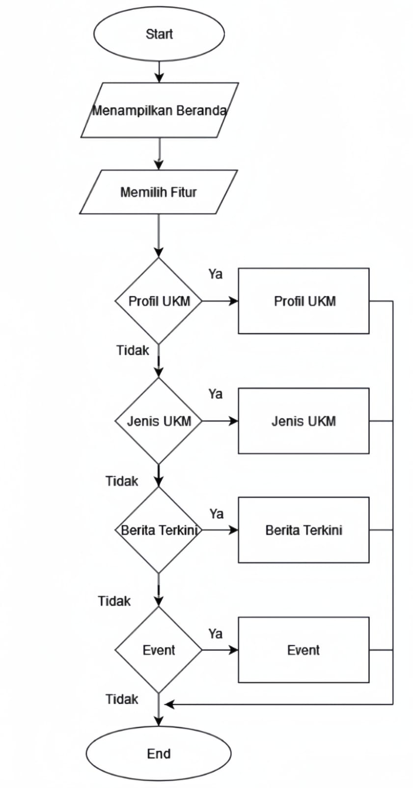
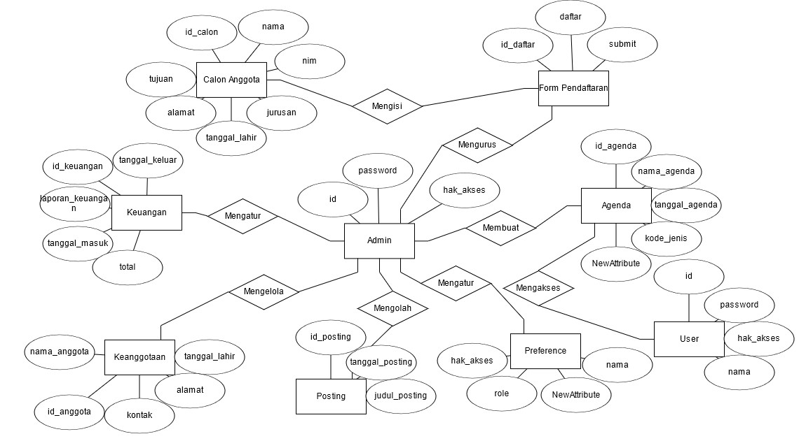
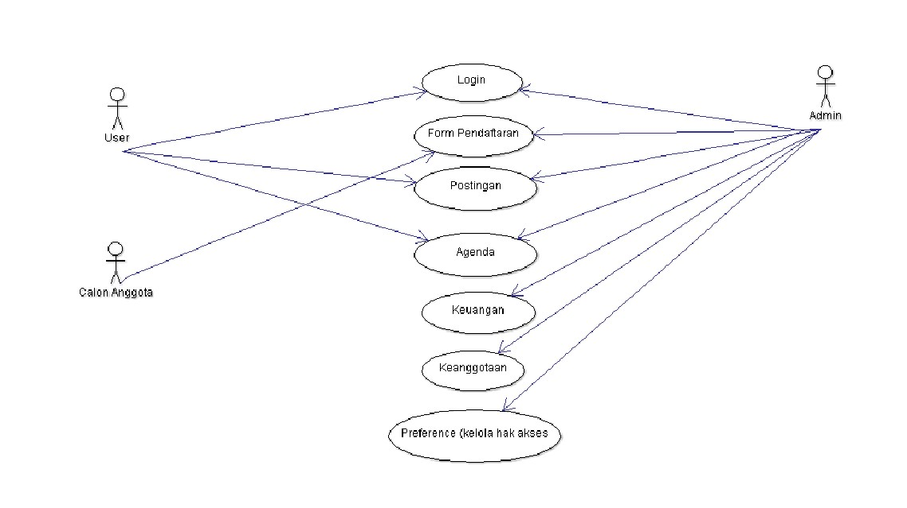
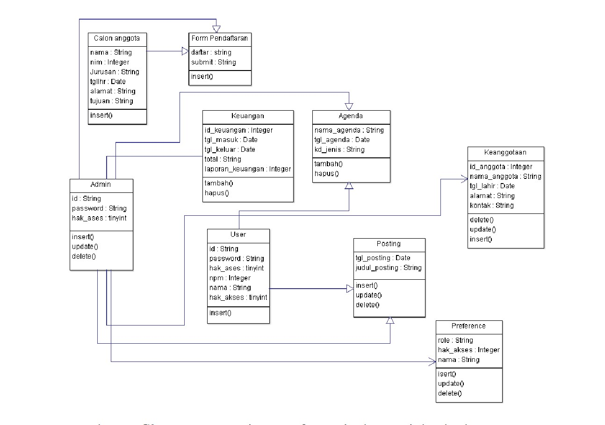

# Website-UKM
Spesifikasi Kebutuhan Perangkat Lunak

Untuk

Website UKM

Versi 1.0 disetujui

Disusun Oleh: 
  1. Feis Aulia Fatchuriani (22091397053)
  2. Berlin Marsyah Yustina (22091397062)
  3. Tsamarah Mu’adzah Lubis (22091397074)

D4 Manajemen Informatika

Fakultas Vokasi

Universitas Negeri Surabaya

Tahun 2023

1. Pendahuluan 
1.1 Tujuan Penulisan Dokumen

Dokumen SKPL ini bertujuan untuk menciptakan panduan bagi tim pengembangan dalam membangun website yang efisien dan sesuai dengan kebutuhan UKM. Dokumen ini juga akan membantu dalam memastikan bahwa website UKM dapat menyediakan informasi yang lengkap dan terbaru tentang kegiatan, jadwal, dan berita terkini terkait UKM, meningkatkan efektivitas dalam mempromosikan kegiatan serta prestasi UKM kepada anggota mahasiswa, calon anggota, dan masyarakat umum, menyediakan informasi yang lengkap dan terbaru tentang kegiatan, jadwal, dan berita terkini terkait UKM. Selain itu, dokumen ini akan memainkan peran penting dalam mengelola pengembangan agar website berfungsi dengan baik sesuai harapan pengguna. Dengan demikian, tujuan utama dokumen ini adalah memastikan bahwa website UKM bisa menjadi alat yang efektif dalam mencapai tujuan dan visi UKM di lingkungan perguruan tinggi. 

1.2 Konvensi Dokumen
 Konvensi dokumen yang digunakan untuk pengembangan website ini adalah sebagai berikut:
<li>Website adalah halaman informasi yang disediakan melalui jalur internet sehingga bisa diakses di seluruh dunia selama terhubung dengan internet. </li>  
<li>HTML adalah singkatan dari Hyper Text Markup Language yang merupakan sintaks bahasa yang digunakan dalam pengembangan website. 
<li>CSS adalah singkatan dari Cascading Style Sheet yang merupakan salah satu bahasa pemrograman website untuk mengendalikan beberapa komponen dalam sebuah website sehingga akan lebih terstruktur dan seragam.  </li>
<li>JavaScript adalah bahasa pemrograman tingkat tinggi dan dinamis. JavaScript populer di internet dan dapat bekerja di sebagian besar penjelajah web. Kode JavaScript dapat disisipkan dalam halaman web menggunakan tag script.</li> 

1.3 Audiens yang Dituju dan Pembaca yang Disarankan
<li>Audiens: Audiens yang dituju dari website ini adalah para anggota, calon anggota, mahasiswa umum, pengurus, dan dosen dari Universitas Negeri Surabaya yang tertarik untuk mendapatkan informasi lebih detail tentang Unit Kegiatan Mahasiswa (UKM) dan ingin mengenal lebih dalam tentang kegiatan mahasiswa yang ada di Universitas Negeri Surabaya. </li>
<li>Saran: Dokumen SKPL Website Unit Kegiatan Mahasiswa (UKM) ini digunakan untuk mendapatkan informasi yang lebih detail tentang Unit Kegiatan Mahasiswa (UKM) yang ada di Universitas Negeri Surabaya. Oleh karena itu, kami menyarankan kepada pembaca untuk membaca dokumen SKPL ini dengan seksama terlebih dahulu.</li>  
1.4 Lingkup Produk

Lingkup produk untuk website Unit Kegiatan Mahasiswa (UKM) mencakup sejumlah komponen kunci yang dirancang untuk memenuhi kebutuhan dan tujuan UKM tersebut. Halaman utama (homepage) akan memberikan gambaran singkat tentang UKM, dengan informasi mengenai kegiatan dan acara yang akan datang serta tautan penting ke bagian-bagian lainnya. Profil UKM akan memuat informasi rinci mengenai sejarah, visi, misi, dan nilai-nilai UKM, sambil menampilkan struktur organisasi dan daftar pengurus yang bertanggung jawab. Bagian anggota akan memuat daftar anggota UKM, sementara agenda kegiatan akan mencakup daftar acara, pertemuan, dan kegiatan yang diadakan oleh UKM. Ada juga bagian berita dan pengumuman untuk memastikan pengguna tetap terinformasi, serta galeri foto dan video yang berisi dokumentasi visual dari berbagai kegiatan UKM. Selain itu, adanya forum diskusi atau ruang interaksi dapat memungkinkan anggota dan pengguna untuk berkomunikasi, berbagi ide, dan berdiskusi tentang topik-topik tertentu. Semua komponen ini dirancang untuk menciptakan pengalaman yang informatif dan terlibat bagi anggota UKM dan pengguna lainnya dalam mendukung keberhasilan UKM. 

1.5 Referensi  
Dokumen-dokumen yang digunakan sebagai referensi dalam pembuatan SKPL ini adalah sebagai berikut:
<li>Sadewa, I., & Siahaan, K. (2016). Analisis dan Perancangan Sistem Informasi UKM. Jurnal Manajemen Sistem Informasi. </li>
<li>Deni Kusuma Fajri, Agi Putra Kharisma, Ratih Kartika Dewi. (2017). "Perancangan Website Unit Kegiatan Mahasiswa dengan Metodologi Users Centered Design." Jurnal Pengembangan Teknologi Informasi dan Ilmu Komputer, Vol. 1, No. 12, Desember 2017. </li>
<li>Bagja Sumarlin, Dede Rohmat Apandi, Opan Dilaga. (2019). "Rancangan Web Sistem Informasi UKM (SIUK) 'GL01'. </li>
<li>Firdhaus Hari Saputro Al Haris, Sri Huning Anwariningsih, Aziz Jihadian Barid. (2018, Januari 11). "Pemodelan Aplikasi Unit Kegiatan Mahasiswa (UKM) Universitas Sahid Surakarta." Jurnal Gaung Informatika, Vol. 8, No. 2, Juli 2015. </li>
<li>Agung Rifqi Hidayat, Tri Listyorini, Tutik Khotimah. "Aplikasi Manajemen Unit Kegiatan Mahasiswa pada Universitas Muria Kudus Berbasis Web." </li>  
 2. Deskripsi Keseluruhan
 2.1 Perspektif Produk 
	
Website Unit Kegiatan Mahasiswa (UKM) adalah sebuah website online yang dirancang khusus untuk memfasilitasi interaksi dan keterlibatan anggota dan non anggota Unit Kegiatan Mahasiswa (UKM) serta memberikan informasi yang komprehensif tentang semua UKM yang ada di Universitas Negeri Surabaya. Dengan desain dan isi yang menarik dan informatif, website ini digunakan untuk meningkatkan pengalaman anggota UKM, calon anggota, dan pengguna umum yang ingin mengenal lebih dalam kegiatan mahasiswa di universitas. 

	
2.2 Fungsi Produk 

Website Unit Kegiatan Mahasiswa (UKM) memiliki beragam fungsi penting yang mendukung tujuan dan kegiatan UKM tersebut. Berikut adalah beberapa fungsi utama dari website UKM:
Website UKM adalah sarana untuk memperluas jangkauan di kalangan mahasiswa dan masyarakat umum. Ini dapat membantu dalam menarik minat anggota baru dan berpotensi mengundang partisipasi lebih banyak dalam kegiatan UKM.
Website menyediakan platform untuk memberikan informasi lengkap tentang UKM, termasuk tujuan, visi, misi, sejarah, dan struktur organisasi. Calon anggota atau pihak yang tertarik dapat dengan mudah memahami apa yang UKM tawarkan.
Website dapat memiliki formulir pendaftaran anggota online yang memudahkan calon anggota untuk mendaftar ke dalam UKM. Ini juga dapat mengurangi kerumitan administratif.
UKM dapat menggunakan website untuk mengumumkan dan mempromosikan kegiatan-kegiatan yang akan datang. Informasi tentang tanggal, tempat, dan deskripsi acara dapat diakses oleh anggota UKM dan orang-orang yang tertarik.
Website memungkinkan UKM untuk membagikan berita dan pemberitahuan terkini kepada anggota dan pengunjung. Ini termasuk prestasi UKM, perubahan dalam jadwal, atau pemberitahuan penting lainnya.

2.3 Kelas dan Karakteristik Pengguna
  Website UKM ini berkaitan dengan beberapa entitas luar, yaitu mahasiswa, senat dan admin UKM. Hal-hal yang dilakukan oleh entitas-entitas tersebut yaitu :
  Mahasiswa
<li>Dapat melakukan pendaftaran ke UKM </li>
<li>Dapat mencari informasi mengenai UKM </li>
<li>Dapat mengetahui kegiatan UKM </li>
<li>Dapat melihat data anggota UKM </li>
 Senat
<li>Melihat kegiatan UKM </li>
<li>Memverifikasi kegiatan UKM </li>
<li>Memverifikasi kehadiran kegiatan UKM </li>
<li>Dapat melihat data anggota UKM </li>
 Admin UKM
<li>Membuat kegiatan UKM </li>
<li>Menerima pendaftaran UKM </li>
<li>Dapat melihat dan mengubah data anggota UKM </li>
 2.4 Lingkungan Operasi 
<li>Server Side </li>
Perangkat yang digunakan adalah Windows sebagai Operating System (Sistem Operasi)
<li>Client Side</li>
Perangkat lainnya adalah:
IOS, Android, dan Windows sebagai sistem operasi menjalankan dan mengunjungi sistem
<li>Development Tools </li>
Perangkat yang digunakan untuk pengembangan sistem dan penyimpanan database adalah:
PhpMyAdmin sebagai sistem penyimpanan database Pengguna dan admin.
HTML, CSS, dan JavaScript sebagai Bahasa pemrograman.
Browser dan Develpment sebagai pengujian dan debug.  
 2.5 Kendala Desain dan Implementasi 

Desain dan implementasi website UKM dapat menghadapi sejumlah kendala yang perlu diperhatikan. Berikut adalah beberapa kendala umum yang mungkin timbul selama proses ini dan cara mengatasinya:
<li>Beberapa website UKM sering kali menghadapi masalah dengan kurangnya konten yang diperbarui secara teratur. Untuk mengatasi ini, buat rencana konten yang jelas dan libatkan anggota UKM dalam penghasilan konten baru. </li>
<li>Keamanan website adalah hal yang penting. Pastikan untuk menginstal pembaruan keamanan secara berkala dan menggunakan alat keamanan yang sesuai untuk melindungi website dari serangan dan ancaman siber.</li>
<li>Sekalipun website telah dibangun, jika tidak dipromosikan dengan baik, mungkin akan kurang dikenal oleh mahasiswa dan masyarakat. Pastikan untuk memasukkan tautan ke website UKM dalam berbagai materi promosi UKM. </li>
<li>Website yang diisi dengan konten yang tidak berkualitas dapat mengurangi reputasi UKM. Pastikan bahwa semua konten yang diunggah ke website memiliki kualitas yang baik dan relevan.
UKM mungkin kesulitan mendapatkan dukungan keuangan untuk pemeliharaan website. Cari cara untuk memasukkan pemeliharaan website dalam anggaran UKM atau cari sponsor atau donatur yang dapat membantu dalam pembiayaan ini. </li> 

2.6 Dokumentasi Pengguna

Dokumentasi bagi pengguna Website UKM antara lain sebagai berikut:
 1. Deskripsi Umum Sistem:
<li>Tujuan: Website UKM ini bertujuan untuk memfasilitasi mahasiswa dalam pengembangan diri melalui kegiatan-kegiatan yang sesuai dengan minat, bakat, dan kreativitas mereka. Website ini juga bertujuan untuk memberikan informasi, komunikasi, dan koordinasi antara pengurus, anggota, dan calon anggota unit kegiatan mahasiswa </li>
<li>Manfaat: Manfaat website UKM ini membantu mahasiswa mengasah kemampuan dan ketrampilan dalam bidang tertentu, mengembangkan keterampilan berorganisasi, komunikasi dan sosial, serta memperluas jaringan dan silaturahmi, sekaligus meningkatkan prestasi dan kontribusi terhadap sekolah dan masyarakat. </li>
2. Fitur: 
<li>Profil ukm yang berisi tentang visi, misi, sejarah, struktur organisasi, prestasi, dan kontak ukm. </li>
<li>Galeri ukm yang berisi tentang foto-foto, video-video, atau karya-karya yang dihasilkan oleh ukm. </li>
<li>Berita ukm yang berisi tentang informasi terbaru, agenda, pengumuman, atau laporan kegiatan yang dilakukan anggota ukm.</li>
<li>Forum ukm yang berisi tentang ruang diskusi, tanya jawab, atau sharing antara pengurus, anggota, dan calon anggota ukm tersebut.</li>
<li>Pendaftaran ukm yang berisi tentang formulir online untuk mendaftar sebagai anggota atau calon anggota ukm. </li>
 2.7 Asumsi dan Ketergantungan

Dalam pengembangan website Unit Kegiatan Mahasiswa (UKM), terdapat beberapa asumsi dan dependensi yang perlu dipertimbangkan. Asumsi dan dependensi ini adalah faktor-faktor yang dapat memengaruhi perencanaan, pengembangan, dan pengelolaan website tersebut. 

Asumsi:

1. Ketersediaan Anggaran: Asumsi bahwa ada anggaran yang cukup untuk mendukung pengembangan dan pemeliharaan website UKM.

2. Akses Internet: Asumsi bahwa anggota UKM dan pengguna umum memiliki akses internet yang memadai untuk mengakses website.

3. Penggunaan Perangkat Modern: Asumsi bahwa pengguna website UKM menggunakan perangkat modern yang mendukung teknologi web terbaru, seperti browser yang kompatibel.

4. Konten Tersedia: Asumsi bahwa konten seperti informasi tentang UKM, jadwal kegiatan, dan berita akan disediakan oleh pengurus UKM atau pihak terkait.

5. Kerjasama Tim: Asumsi bahwa ada kerjasama yang baik antara pengembang web dan pengurus UKM dalam mengelola dan memperbarui konten website.

Dependensi:

1. Basis Data UKM: Website UKM mungkin bergantung pada basis data yang mengandung informasi tentang anggota, kegiatan, dan berbagai data terkait UKM. Ketergantungan ini memerlukan pemeliharaan dan pengelolaan basis data.

2. Hosting Web: Website UKM memerlukan hosting web yang dapat diandalkan dan skalabel. Ketergantungan ini terkait dengan pemilihan penyedia hosting dan perawatan server.

3. Keamanan Informasi: Website UKM dapat menjadi target serangan siber, oleh karena itu, diperlukan dependensi pada langkah-langkah keamanan seperti firewall, enkripsi, dan pemantauan keamanan.

4. Ketersediaan Konten: Untuk menjaga website tetap informatif, dependensi pada pihak yang bertanggung jawab untuk menyediakan konten yang relevan dan terbaru, termasuk pengurus UKM yang harus memberikan informasi terkini.

5. Kompatibilitas Browser: Website UKM harus dapat diakses dengan baik di berbagai browser web yang berbeda. Ini bergantung pada kemampuan pengembang untuk menguji dan memastikan kompatibilitas.

6. Kepatuhan Hukum: Website UKM perlu mematuhi semua peraturan dan hukum yang berlaku, seperti privasi data dan hak cipta. Dependensi pada pemahaman dan kepatuhan terhadap regulasi ini sangat penting.

7. Sumber Daya Manusia: Terkadang, pengembangan dan pemeliharaan website memerlukan sumber daya manusia yang terampil. Dependensi pada keberadaan atau ketersediaan pengembang web yang kompeten dapat memengaruhi proyek.

8. Pengalaman Pengguna: Website UKM harus dirancang dengan mempertimbangkan pengalaman pengguna. Dependensi pada umpan balik dari pengguna dan penyesuaian berdasarkan respons tersebut. 

  3. Kebutuhan Antarmuka Eksternal  
3.1 Antarmuka Pengguna
<li>Aplikasi menggunakan antarmuka berbasis web. </li>
<li>Pengguna berinteraksi dengan sistem menggunakan keyboard dan mouse. </li>  
3.2 Antarmuka Perangkat Keras

Antarmuka perangkat keras dari website UKM mengacu pada bagian dari sistem yang berinteraksi langsung dengan perangkat keras fisik yang mendukung operasi dan kinerja website. Berikut adalah beberapa komponen antarmuka perangkat keras yang perlu diperhatikan dalam pengembangan dan pengelolaan website UKM:
1. Server
Server adalah perangkat keras utama yang menyimpan dan mengelola data, konten, dan aplikasi yang diperlukan untuk website UKM. Server ini dapat berupa server fisik (hardware server) atau server virtual (virtual server) yang di-hosting di cloud.
2. Basis Data
Basis data (database server) adalah komponen perangkat keras yang digunakan untuk menyimpan, mengelola, dan mengambil data yang diperlukan oleh website, seperti informasi anggota, konten, dan catatan kegiatan.
3. Infrastruktur Jaringan
Infrastruktur jaringan melibatkan perangkat keras seperti router, switch, dan firewall yang memungkinkan website untuk berkomunikasi dengan pengguna dan perangkat lain di internet dengan aman.
4. Penyimpanan
Kapasitas penyimpanan adalah komponen perangkat keras yang penting untuk menyimpan konten website, gambar, video, dan berkas lainnya. Ini dapat mencakup hard drive fisik di server atau penyimpanan awan (cloud storage).
6. Memori
Memori (RAM) adalah komponen perangkat keras yang digunakan untuk menyimpan data sementara yang diperlukan oleh server saat menjalankan aplikasi web. Memori yang cukup besar dapat meningkatkan kinerja website. 

3.3 Antarmuka Perangkat Lunak
  <li>Aplikasi diakses menggunakan web browser. </li>
  <li>Dikembangkan menggunakan bahasa pemrograman html, css, java script. </li>
  <li>Database yang digunakan adalah msql. </li>
  3.4 Antarmuka Komunikasi

 Website UKM ini merupakan suatu sistem yang dihubungkan ke jaringan komputer melalui komputer desktop, sehingga pihak yang bertugas (admin, manager) dapat memantau sistem melalui jaringan komputer. Dengan demikian, aliran informasi menjadi lebih lancar. 

4. Fitur Sistem dan Kerangka Desain Fitur

  5. Persyaratan Nonfungsional Lainnya
 5.1 Persyaratan Kinerja
Persyaratan kinerja adalah aspek kritis dalam merancang dan mengembangkan website UKM. Berikut adalah beberapa persyaratan kinerja yang perlu dipertimbangkan untuk website UKM:
<li>Waktu Muat Halaman </li>
Website memuat halaman utama dalam waktu yang cepat, biasanya dalam beberapa detik.
<li>Kapasitas Pengguna </li>
Website harus mampu menangani jumlah pengguna yang berinteraksi dengan website secara bersamaan tanpa mengalami penurunan kinerja yang signifikan.
<li>Kecepatan Respons Server </li>
Server yang menjalankan website harus memberikan respons dalam waktu yang cepat terhadap permintaan pengguna.
<li>Skalabilitas </li>
Website harus dapat berkembang dengan baik seiring pertumbuhan dan peningkatan pengguna.
<li>Kompatibilitas Perangkat dan Browser </li>
Website harus kompatibel dengan berbagai perangkat (desktop, mobile, tablet) dan berbagai browser web. 
  5.2 Persyaratan Keselamatan 

Website UKM ini sangat aman untuk digunakan oleh pengguna dan hanya berhubungan langsung dengan admin. Maka, ketika terjadi permasalahan yang mengakibatkan kebobolan data pengguna ketika menggunakan website, pengguna dapat langsung melaporkan kejadian tersebut ke pihak berwenang. 

5.3 Persyaratan Keamanan 
 Persyaratan keamanan website Unit Kegiatan Mahasiswa (UKM) sangat penting untuk melindungi data dan pengguna, mencegah ancaman siber, serta menjaga integritas dan ketersediaan website. Berikut adalah beberapa persyaratan keamanan yang perlu dipertimbangkan dalam pengembangan dan pengelolaan website UKM:
<li>Proteksi Data Pengguna </li>
Website harus memiliki mekanisme enkripsi data (HTTPS) untuk melindungi data pribadi dan sensitif pengguna, seperti informasi pendaftaran anggota.
<li>Manajemen Akses yang Tepat </li>
Hanya pengguna yang sah dan berwenang yang harus memiliki akses ke bagian-bagian tertentu dari website, seperti data anggota atau informasi penting lainnya.
<li>Pemantauan Keamanan </li>
Website harus memantau keamanan yang memungkinkan deteksi cepat terhadap aktivitas mencurigakan atau ancaman siber.
<li>Pengelolaan Kata Sandi yang Kuat </li>
Pengguna harus diharuskan menggunakan kata sandi yang kuat, dan website harus memiliki kebijakan perubahan kata sandi secara berkala.
<li>Pencatatan Keamanan </li>
Website harus mencatat aktivitas keamanan, termasuk upaya masuk yang gagal, untuk menganalisis dan melacak insiden potensial.

  5.4 Atribut Kualitas Perangkat Lunak
Berikut adalah contoh atribut kualitas perangkat lunak dalam konteks sebuah website UKM:
<li>Ketersediaan </li>
Website harus tersedia 24/7 sehingga anggota UKM dapat mengakses informasi dan layanan kapan saja.
<li>Kinerja </li>
Website memiliki waktu muat halaman yang cepat sehingga pengguna tidak mengalami penundaan saat mengakses informasi atau mendaftar kegiatan UKM.
<li>Usability </li>
Antarmuka pengguna website dirancang dengan baik, dengan menu navigasi yang jelas dan instruksi yang mudah dipahami untuk memudahkan anggota mendaftar atau menemukan informasi.
<li>Portabilitas </li>
Website berfungsi dengan baik di berbagai browser web.
<li>Integrasi </li>
Website terhubung dengan sistem basis data UKM untuk mengelola informasi anggota, sehingga data dapat diakses dan diperbarui dengan mudah.
<li>Keamanan Data </li>
Data anggota dan catatan kegiatan UKM disimpan dengan enkripsi yang kuat dan hanya dapat diakses oleh pihak yang berwenang.

  5.5 Atribut Bisnis

Atribut bisnis dalam website UKM adalah kunci yang mendukung pertumbuhan dan keberhasilan unit kegiatan mahasiswa tersebut. Salah satu atribut bisnis yang penting adalah kemampuan website untuk menarik anggota baru dan mendorong partisipasi aktif dalam kegiatan UKM. Dengan antarmuka yang menarik dan informasi yang mudah diakses, website dapat menjadi alat yang efektif dalam menarik minat mahasiswa untuk bergabung dan berkontribusi dalam UKM. Selain itu, kemampuan website dalam mempromosikan acara, kegiatan, atau produk UKM secara efektif juga merupakan atribut bisnis yang penting. Melalui pemasaran yang baik, website dapat meningkatkan visibilitas UKM dan menarik minat dari calon anggota atau sponsor potensial, yang dapat membantu dalam mendukung kegiatan UKM. Interaksi yang baik dengan pengguna, baik anggota UKM maupun pemangku kepentingan lainnya, juga menjadi faktor penting dalam membangun komunitas yang kuat dan berkelanjutan. Dengan demikian, atribut bisnis ini berkontribusi secara signifikan dalam mencapai tujuan dan kesuksesan UKM melalui website. 

6. Persyaratan Lainnya
<li>Admin: Pemilik yang merupakan seseorang yang bertanggungjawab untuk perawatan sistem dan serta bertanggungjawab terhadap operasional sistem.</li>
<li>User: Karyawan yang merupakan seseorang yang bertanggungjawab terhadap pelayanan pemesanan.</li>
<li>Website: Halaman informasi yang disediakan melalui jalur internet sehingga bisa diakses di seluruh dunia selama terhubung dengan internet. </li>
<li>HTML: Singkatan dari Hyper Text Markup Language yang merupakan sintaks bahasa yang digunakan dalam pengembangan website. </li>
<li>CSS: Singkatan dari Cascading Style Sheet yang merupakan salah satu bahasa pemrograman website untuk mengendalikan beberapa komponen dalam sebuah website sehingga akan lebih terstruktur dan seragam. </li>
<li>PHP: Singkatan dari Hypertext Prepocessor yang merupakan bahasa pemrograman yang digunakan secara luas untuk penanganan pembuatan dan pengembangan sebuah website dan bisa digunakan bersamaan dengan HTML.Javascript: Bahasa pemrograman tingkat tinggi dan dinamis. Javascript populer di internet dan dapat bekerja di sebagian besar penjelajah web. Kode javascript dapat disisipkan dalam halaman web menggunakan tag script. </li>
<li>Maintanance: Kegiatan untuk memelihara atau menjaga suatu sistem dan mengadakan perbaikan atau penggantian yang diperlukan agar terdapat suatu keadaan operasi yang memuaskan sesuai dengan apa yang direncanakan. </li>

  Lampiran A: Glosarium

Lampiran B: Analisa Model
  Flowchart

  Entity Relationship Diagram 

  Use Case

  Class Diagram

Lampiran C: Daftar yang akan ditentukan

Daftar yang ditentukan dalam website UKM dapat bervariasi tergantung pada jenis UKM, tujuan website, dan kebutuhan anggota serta pengguna lainnya. Namun, berikut adalah beberapa jenis daftar yang umumnya ditemukan dalam website UKM:
Daftar Anggota
Daftar anggota UKM beserta profil masing-masing, termasuk nama, jurusan, tahun masuk, dan kontak informasi. Ini memungkinkan anggota untuk mengenal satu sama lain dan mempermudah komunikasi dalam UKM.
Agenda Kegiatan
Daftar acara, pertemuan, dan kegiatan yang diadakan oleh UKM, beserta tanggal, waktu, dan lokasi. Ini membantu anggota dan pengguna lain untuk mengetahui jadwal kegiatan UKM.
Berita dan Pengumuman
Daftar berita, pengumuman, atau artikel terkait UKM, seperti kegiatan UKM, prestasi anggota, atau informasi terbaru. Ini memungkinkan anggota dan pengguna untuk tetap terinformasi.
Galeri Foto dan Video
Daftar foto dan video terkait kegiatan dan acara UKM. Ini memungkinkan pengguna untuk melihat dokumentasi visual dari kegiatan UKM.
Pendaftaran Kegiatan 

Daftar kegiatan atau acara yang memerlukan pendaftaran, beserta formulir pendaftaran dan informasi terkait proses pendaftaran.
Kontak dan Informasi Hubungi
Daftar informasi kontak UKM, termasuk alamat email, nomor telepon, alamat fisik, atau formulir kontak online untuk pertanyaan atau permintaan informasi.

  Dokumentasi dan Penjelasan Kode:
  https://github.com/feisauu/Website-UKM/files/13121739/Dokumentasi.dan.Penjelasan.Source.Code.Website.UKM.docx
